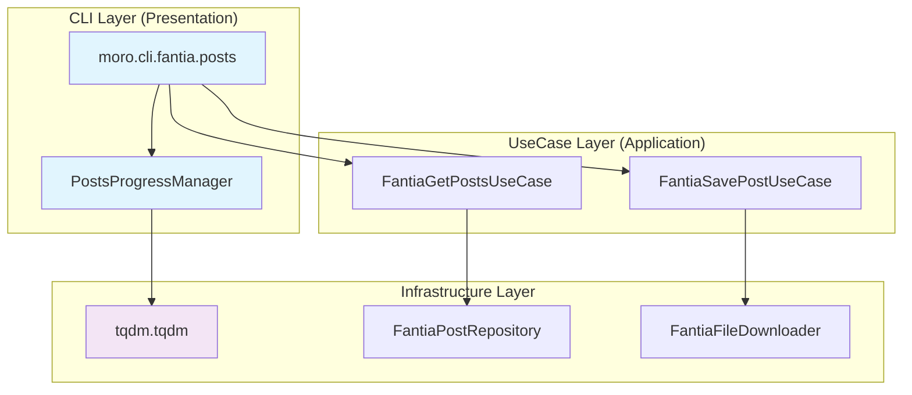
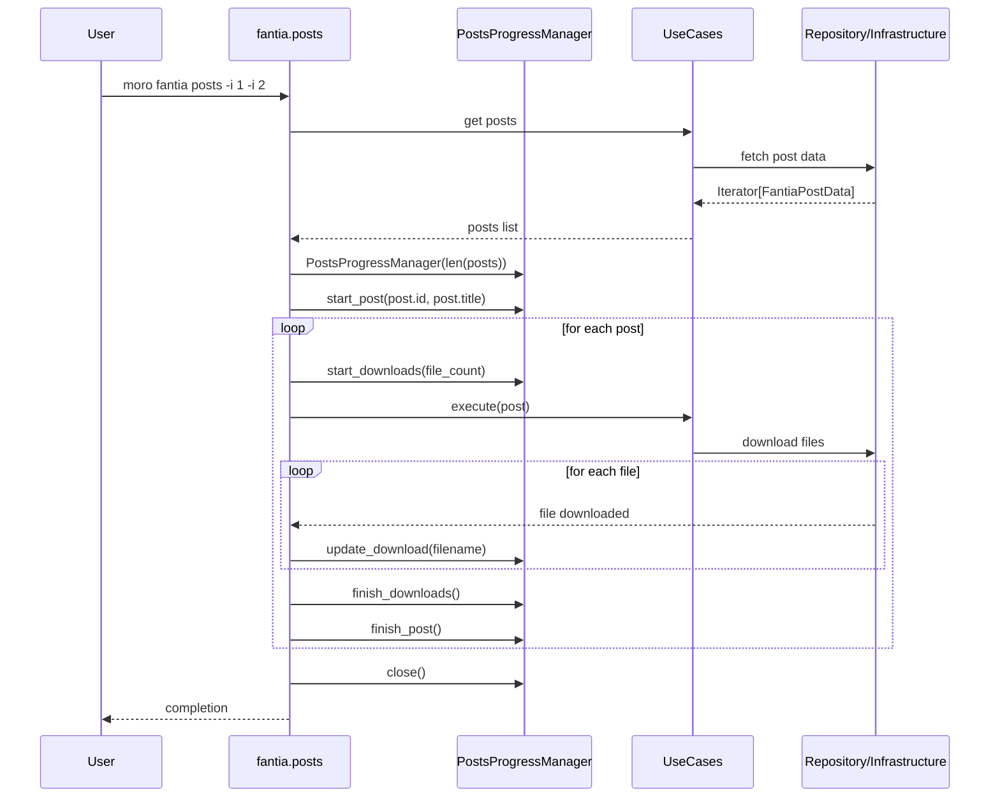

# `moro fantia posts` tqdmプログレスバー機能 - 設計書

## アーキテクチャ概要

Clean Architectureに準拠し、プログレスバー機能をCLI層に配置した設計。不要な抽象化を避け、将来的に差し替えが起こり得ない箇所では具象クラスを直接使用。

## システム設計

### アーキテクチャ図



### データフロー図



## コンポーネント設計

### 1. PostsProgressManager (CLI層)

**責任**: posts処理の進捗表示とtqdmプログレスバー管理

```python
from typing import Optional
from tqdm import tqdm

class PostsProgressManager:
    """Posts処理の進捗を管理するクラス"""

    def __init__(self, total_posts: int) -> None:
        """プログレスバーマネージャーを初期化

        Args:
            total_posts: 処理対象のpost総数
        """
        self.main_progress = tqdm(
            total=total_posts,
            desc="Processing posts",
            unit="post",
            bar_format="{desc}: {n}/{total} [{bar}] {percentage:3.0f}% | {postfix}"
        )
        self.current_download_progress: Optional[tqdm] = None

    def start_post(self, post_id: str, title: str) -> None:
        """投稿処理開始時の表示更新

        Args:
            post_id: 処理中のpost ID
            title: post タイトル
        """
        truncated_title = title[:30] + "..." if len(title) > 30 else title
        self.main_progress.set_postfix_str(f"Post: {post_id} ({truncated_title})")

    def start_downloads(self, total_files: int, post_id: str) -> None:
        """ファイルダウンロード開始

        Args:
            total_files: ダウンロード対象ファイル数
            post_id: 対象post ID
        """
        if total_files > 1:  # 複数ファイルの場合のみネストプログレスバー表示
            self.current_download_progress = tqdm(
                total=total_files,
                desc="  Downloading",
                unit="file",
                leave=False,
                bar_format="  {desc}: {n}/{total} [{bar}] {percentage:3.0f}% | {postfix}"
            )

    def update_download(self, filename: str) -> None:
        """ダウンロード進捗更新

        Args:
            filename: ダウンロード完了したファイル名
        """
        if self.current_download_progress:
            truncated_name = filename[-20:] if len(filename) > 20 else filename
            self.current_download_progress.set_postfix_str(truncated_name)
            self.current_download_progress.update(1)

    def finish_downloads(self) -> None:
        """ダウンロード処理完了"""
        if self.current_download_progress:
            self.current_download_progress.close()
            self.current_download_progress = None

    def finish_post(self) -> None:
        """投稿処理完了"""
        self.main_progress.update(1)

    def close(self) -> None:
        """全体処理完了・クリーンアップ"""
        if self.current_download_progress:
            self.current_download_progress.close()
        self.main_progress.close()
```

### 2. CLI統合修正

**ファイル**: `src/moro/cli/fantia.py`

```python
def posts(post_id: tuple[str], fanclub_id: str, verbose: tuple[bool]) -> None:
    """Download posts by their IDs with progress bar."""
    config = ConfigRepository.create()
    config_logging(config, verbose)
    injector = create_injector(config)

    # 既存のpost取得ロジック
    post_ids = list(post_id)
    if fanclub_id:
        fanclub = injector.get(FantiaGetFanclubUseCase).execute(fanclub_id)
        if not fanclub:
            click.echo(f"Fanclub with ID {fanclub_id} not found.")
            return
        post_ids.extend(post for post in fanclub.posts)

    # postsをリストに変換（進捗表示のため）
    posts = list(injector.get(FantiaGetPostsUseCase).execute(post_ids))

    # プログレスバー初期化（CLI層で管理）
    progress_manager = PostsProgressManager(len(posts))

    try:
        save_usecase = injector.get(FantiaSavePostUseCase)

        for post in posts:
            progress_manager.start_post(post.id, post.title)

            # ファイル数推定（post dataから）
            file_count = _estimate_file_count(post)
            progress_manager.start_downloads(file_count, post.id)

            # 既存のUseCase実行（変更不要）
            save_usecase.execute(post)

            progress_manager.finish_downloads()
            progress_manager.finish_post()

    except KeyboardInterrupt:
        click.echo("\nOperation cancelled by user")
    except Exception as e:
        click.echo(f"Error during processing: {e}")
        raise
    finally:
        progress_manager.close()


def _estimate_file_count(post: FantiaPostData) -> int:
    """投稿からダウンロード対象ファイル数を推定

    Args:
        post: 投稿データ

    Returns:
        推定ファイル数
    """
    file_count = 0

    for content in post.contents:
        if isinstance(content, FantiaPhotoGallery):
            file_count += len(content.photos)
        elif isinstance(content, FantiaFile):
            file_count += 1
        elif isinstance(content, FantiaProduct) and content.file:
            file_count += 1

    # サムネイル画像も考慮
    if post.thumb:
        file_count += 1

    return max(file_count, 1)  # 最小1ファイル
```

### 3. Infrastructure層の修正

**ファイル**: `src/moro/modules/fantia/infrastructure.py`

FantiaFileDownloaderに進捗コールバック機能を追加：

```python
from typing import Callable, Optional

class FantiaFileDownloader:
    # 既存のメソッド...

    def download_all_content(
        self,
        post_data: FantiaPostData,
        post_directory: str,
        progress_callback: Optional[Callable[[str], None]] = None
    ) -> bool:
        """Download all content for a post with optional progress callback.

        Args:
            post_data: Post data to download
            post_directory: Target directory
            progress_callback: Called when each file is downloaded

        Returns:
            True if all downloads succeeded
        """
        success = True

        for content in post_data.contents:
            if isinstance(content, FantiaPhotoGallery):
                for photo in content.photos:
                    if not self._download_file(photo.url, post_directory, photo.filename):
                        success = False
                    elif progress_callback:
                        progress_callback(photo.filename)

            elif isinstance(content, FantiaFile):
                if not self._download_file(content.url, post_directory, content.filename):
                    success = False
                elif progress_callback:
                    progress_callback(content.filename)

            elif isinstance(content, FantiaProduct) and content.file:
                if not self._download_file(content.file.url, post_directory, content.file.filename):
                    success = False
                elif progress_callback:
                    progress_callback(content.file.filename)

        # サムネイル画像のダウンロード
        if post_data.thumb:
            thumb_filename = f"thumb_{post_data.id}.jpg"
            if not self._download_file(post_data.thumb.url, post_directory, thumb_filename):
                success = False
            elif progress_callback:
                progress_callback(thumb_filename)

        return success
```

### 4. UseCase層の修正

**ファイル**: `src/moro/modules/fantia/usecases.py`

FantiaSavePostUseCaseに進捗コールバック対応を追加：

```python
class FantiaSavePostUseCase:
    # 既存のメソッド...

    def execute(
        self,
        post_data: FantiaPostData,
        progress_callback: Optional[Callable[[str], None]] = None
    ) -> None:
        """Execute the use case to save a post with optional progress tracking.

        Args:
            post_data: The post data to save
            progress_callback: Called when each file is downloaded

        Raises:
            IOError: If saving fails
        """
        post_directory = self._create_post_directory(post_data)

        # 進捗コールバック付きでダウンロード実行
        download_success = self.file_downloader.download_all_content(
            post_data,
            post_directory,
            progress_callback
        )

        if not download_success:
            self._cleanup_partial_download(post_directory)
            raise OSError("Failed to download all content for the post")
```

## TypeScript型定義（設計参考）

```typescript
// プログレス管理の型定義
interface PostProgressManager {
  startPost(postId: string, title: string): void;
  startDownloads(totalFiles: number, postId: string): void;
  updateDownload(filename: string): void;
  finishDownloads(): void;
  finishPost(): void;
  close(): void;
}

// 進捗コールバックの型
type ProgressCallback = (filename: string) => void;

// Post処理のフロー
interface PostProcessingFlow {
  posts: FantiaPostData[];
  progressManager: PostProgressManager;

  process(): Promise<void>;
}
```

## 依存関係管理

### pyproject.toml 修正

```toml
dependencies = [
    # 既存の依存関係...
    "tqdm>=4.65.0",  # 追加
]
```

### DIコンテナ統合

PostsProgressManagerは具象クラスとして直接CLI層で生成。DIコンテナには登録せず、必要時にインスタンス化。

## エラーハンドリング設計

### 1. キーボード中断（Ctrl+C）

```python
try:
    # メイン処理
    for post in posts:
        # ...
except KeyboardInterrupt:
    click.echo("\nOperation cancelled by user")
    return
finally:
    progress_manager.close()  # 必ず実行
```

### 2. ネットワークエラー・ダウンロード失敗

```python
try:
    save_usecase.execute(post, progress_manager.update_download)
except Exception as e:
    logger.error(f"Failed to process post {post.id}: {e}")
    # エラーでも次のpostに継続
    continue
finally:
    progress_manager.finish_downloads()
    progress_manager.finish_post()
```

### 3. 部分失敗時の表示

プログレスバーはファイル単位で更新するため、部分失敗でも進捗が可視化される。

## パフォーマンス考慮事項

### 1. メモリ使用量

- tqdmインスタンス: 各プログレスバー当たり数KB
- PostsProgressManager: 軽量な状態管理のみ

### 2. CPU オーバーヘッド

- プログレスバー更新頻度: ファイル完了時のみ（高頻度更新なし）
- 文字列処理: タイトル・ファイル名の切り詰め処理のみ

### 3. ターミナル互換性

- tqdm標準機能を使用（幅広い環境で動作）
- CI環境での非対話モード自動判定

## テスト戦略

### 1. 単体テスト

```python
def test_posts_progress_manager():
    manager = PostsProgressManager(total_posts=3)

    # 基本フロー
    manager.start_post("123", "Test Post")
    manager.start_downloads(2, "123")
    manager.update_download("file1.jpg")
    manager.update_download("file2.jpg")
    manager.finish_downloads()
    manager.finish_post()

    manager.close()
```

### 2. 統合テスト

```python
def test_posts_command_with_progress(mock_injector):
    # プログレスバー付きでのpostsコマンド実行テスト
    with patch('moro.cli.fantia.PostsProgressManager') as mock_progress:
        # テスト実行
        runner = CliRunner()
        result = runner.invoke(posts, ['-i', '123'])

        # プログレスバー呼び出し確認
        mock_progress.assert_called_once()
```

## 次フェーズへの引き継ぎ事項

1. **実装タスクの具体化**: ファイル別の変更箇所とコード
2. **テストケースの詳細設計**: 各コンポーネントのテスト内容
3. **エラーケースの網羅**: 想定される例外状況と対応
4. **パフォーマンス目標の設定**: 具体的な性能基準
