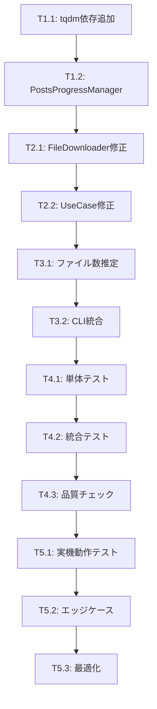

# `moro fantia posts` tqdmプログレスバー機能 - 実装タスク

## 実装戦略

**段階的実装アプローチ**: 依存関係の順序に従い、テスト駆動開発（TDD）で実装。各段階で動作確認を行い、品質を保証。

## 実装タスクリスト

### Phase 1: 基盤整備 (1-2時間)

#### T1.1: 依存関係追加

- [ ] **pyproject.toml**: tqdm依存関係追加
- [ ] **動作確認**: `uv sync` 実行、tqdmインポートテスト

```bash
# 実行手順
echo 'tqdm>=4.65.0' >> pyproject.toml  # dependencies に追加
uv sync
uv run python -c "import tqdm; print('tqdm imported successfully')"
```

#### T1.2: PostsProgressManagerクラス実装

- [ ] **ファイル作成**: `src/moro/cli/_progress.py`
- [ ] **基本実装**: PostsProgressManagerクラス
- [ ] **単体テスト**: 基本フロー動作確認

**実装内容**:

```python
# src/moro/cli/_progress.py
from typing import Optional
from tqdm import tqdm

class PostsProgressManager:
    """Posts処理の進捗を管理するクラス"""

    def __init__(self, total_posts: int) -> None:
        self.main_progress = tqdm(
            total=total_posts,
            desc="Processing posts",
            unit="post",
            bar_format="{desc}: {n}/{total} [{bar}] {percentage:3.0f}% | {postfix}"
        )
        self.current_download_progress: Optional[tqdm] = None

    def start_post(self, post_id: str, title: str) -> None:
        truncated_title = title[:30] + "..." if len(title) > 30 else title
        self.main_progress.set_postfix_str(f"Post: {post_id} ({truncated_title})")

    def start_downloads(self, total_files: int, post_id: str) -> None:
        if total_files > 1:
            self.current_download_progress = tqdm(
                total=total_files,
                desc="  Downloading",
                unit="file",
                leave=False,
                bar_format="  {desc}: {n}/{total} [{bar}] {percentage:3.0f}% | {postfix}"
            )

    def update_download(self, filename: str) -> None:
        if self.current_download_progress:
            truncated_name = filename[-20:] if len(filename) > 20 else filename
            self.current_download_progress.set_postfix_str(truncated_name)
            self.current_download_progress.update(1)

    def finish_downloads(self) -> None:
        if self.current_download_progress:
            self.current_download_progress.close()
            self.current_download_progress = None

    def finish_post(self) -> None:
        self.main_progress.update(1)

    def close(self) -> None:
        if self.current_download_progress:
            self.current_download_progress.close()
        self.main_progress.close()
```

**テスト実装**:

```python
# tests/cli/test_progress.py
import pytest
from moro.cli._progress import PostsProgressManager

def test_posts_progress_manager_basic_flow():
    """基本的な進捗管理フローのテスト"""
    manager = PostsProgressManager(total_posts=2)

    # Post 1
    manager.start_post("123", "Test Post 1")
    manager.start_downloads(2, "123")
    manager.update_download("file1.jpg")
    manager.update_download("file2.jpg")
    manager.finish_downloads()
    manager.finish_post()

    # Post 2
    manager.start_post("456", "Test Post 2")
    manager.start_downloads(1, "456")  # 単一ファイル
    manager.update_download("single.jpg")
    manager.finish_downloads()
    manager.finish_post()

    manager.close()

def test_long_title_truncation():
    """長いタイトルの切り詰めテスト"""
    manager = PostsProgressManager(total_posts=1)
    long_title = "Very Long Title " * 10  # 170文字程度

    manager.start_post("123", long_title)
    # 内部的に30文字+...に切り詰められることを確認
    manager.close()
```

### Phase 2: Infrastructure層修正 (2-3時間)

#### T2.1: FantiaFileDownloader進捗コールバック追加

- [ ] **ファイル修正**: `src/moro/modules/fantia/infrastructure.py`
- [ ] **メソッド拡張**: `download_all_content`にprogress_callback追加
- [ ] **単体テスト**: コールバック機能動作確認

**実装箇所** (`infrastructure.py:FantiaFileDownloader`):

```python
def download_all_content(
    self,
    post_data: FantiaPostData,
    post_directory: str,
    progress_callback: Optional[Callable[[str], None]] = None
) -> bool:
    """Download all content with optional progress callback"""
    success = True

    for content in post_data.contents:
        if isinstance(content, FantiaPhotoGallery):
            for photo in content.photos:
                if not self._download_file(photo.url, post_directory, photo.filename):
                    success = False
                elif progress_callback:
                    progress_callback(photo.filename)

        elif isinstance(content, FantiaFile):
            if not self._download_file(content.url, post_directory, content.filename):
                success = False
            elif progress_callback:
                progress_callback(content.filename)

        elif isinstance(content, FantiaProduct) and content.file:
            if not self._download_file(content.file.url, post_directory, content.file.filename):
                success = False
            elif progress_callback:
                progress_callback(content.file.filename)

    # サムネイル
    if post_data.thumb:
        thumb_filename = f"thumb_{post_data.id}.jpg"
        if not self._download_file(post_data.thumb.url, post_directory, thumb_filename):
            success = False
        elif progress_callback:
            progress_callback(thumb_filename)

    return success
```

**テスト実装**:

```python
# tests/modules/test_fantia_infrastructure_progress.py
def test_file_downloader_with_progress_callback():
    """進捗コールバック付きダウンロードのテスト"""
    downloaded_files = []

    def progress_callback(filename: str) -> None:
        downloaded_files.append(filename)

    # モックデータでテスト
    mock_post_data = create_mock_post_with_multiple_files()
    downloader = FantiaFileDownloader(mock_config, mock_fantia_config)

    result = downloader.download_all_content(
        mock_post_data,
        "/tmp/test",
        progress_callback
    )

    assert result is True
    assert len(downloaded_files) == 3  # 期待ファイル数
    assert "file1.jpg" in downloaded_files
```

#### T2.2: UseCaseレイヤー修正

- [ ] **ファイル修正**: `src/moro/modules/fantia/usecases.py`
- [ ] **メソッド拡張**: `FantiaSavePostUseCase.execute`にprogress_callback追加
- [ ] **統合テスト**: Infrastructure→UseCase連携テスト

### Phase 3: CLI統合実装 (2-3時間)

#### T3.1: ファイル数推定関数実装

- [ ] **関数実装**: `_estimate_file_count` in `cli/fantia.py`
- [ ] **テスト実装**: 各コンテンツタイプでのファイル数計算確認

```python
def _estimate_file_count(post: FantiaPostData) -> int:
    """投稿からダウンロード対象ファイル数を推定"""
    file_count = 0

    for content in post.contents:
        if isinstance(content, FantiaPhotoGallery):
            file_count += len(content.photos)
        elif isinstance(content, FantiaFile):
            file_count += 1
        elif isinstance(content, FantiaProduct) and content.file:
            file_count += 1

    if post.thumb:
        file_count += 1

    return max(file_count, 1)
```

#### T3.2: postsコマンド修正

- [ ] **メイン処理修正**: `posts`関数の進捗バー統合
- [ ] **エラーハンドリング**: KeyboardInterrupt、例外処理
- [ ] **統合テスト**: E2Eでのプログレスバー動作確認

**実装内容** (`cli/fantia.py:posts`):

```python
from moro.cli._progress import PostsProgressManager

def posts(post_id: tuple[str], fanclub_id: str, verbose: tuple[bool]) -> None:
    """Download posts by their IDs with progress bar."""
    config = ConfigRepository.create()
    config_logging(config, verbose)
    injector = create_injector(config)

    # 既存のpost取得ロジック
    post_ids = list(post_id)
    if fanclub_id:
        fanclub = injector.get(FantiaGetFanclubUseCase).execute(fanclub_id)
        if not fanclub:
            click.echo(f"Fanclub with ID {fanclub_id} not found.")
            return
        post_ids.extend(post for post in fanclub.posts)

    posts = list(injector.get(FantiaGetPostsUseCase).execute(post_ids))

    # プログレスバー初期化
    progress_manager = PostsProgressManager(len(posts))

    try:
        save_usecase = injector.get(FantiaSavePostUseCase)

        for post in posts:
            progress_manager.start_post(post.id, post.title)

            file_count = _estimate_file_count(post)
            progress_manager.start_downloads(file_count, post.id)

            # 進捗コールバック付きで実行
            save_usecase.execute(post, progress_manager.update_download)

            progress_manager.finish_downloads()
            progress_manager.finish_post()

    except KeyboardInterrupt:
        click.echo("\nOperation cancelled by user")
    except Exception as e:
        click.echo(f"Error during processing: {e}")
        raise
    finally:
        progress_manager.close()
```

### Phase 4: テスト・品質保証 (1-2時間)

#### T4.1: 単体テストスイート

- [ ] **進捗管理テスト**: PostsProgressManager全パターン
- [ ] **ファイル数推定テスト**: 各コンテンツタイプ
- [ ] **エラーケーステスト**: 例外処理、中断処理

#### T4.2: 統合テスト

- [ ] **E2Eテスト**: 実際のpostsコマンド実行
- [ ] **CI対応**: 非対話環境でのテスト実行
- [ ] **性能テスト**: 大量post処理時の動作確認

#### T4.3: コード品質チェック

- [ ] **Linting**: `uv run ruff check`
- [ ] **型チェック**: `uv run mypy`
- [ ] **テストカバレッジ**: `uv run pytest --cov`

### Phase 5: 最終動作確認・最適化 (1時間)

#### T5.1: 実機動作テスト

- [ ] **基本動作**: `moro fantia posts -i <test_id>`
- [ ] **複数post**: `moro fantia posts -i 1 -i 2 -i 3`
- [ ] **fanclub指定**: `moro fantia posts -f <fanclub_id>`

#### T5.2: エッジケース確認

- [ ] **Ctrl+C中断テスト**: 適切な終了処理
- [ ] **ネットワークエラー**: 部分失敗時の継続処理
- [ ] **空post**: ファイルが存在しない場合

#### T5.3: パフォーマンス最適化

- [ ] **メモリ使用量**: 大量post処理時の確認
- [ ] **表示更新頻度**: 過度な更新の回避
- [ ] **ターミナル互換性**: 各環境での動作確認

## 品質基準

### 必須動作基準

- ✅ 複数post処理時に適切なプログレスバー表示
- ✅ ファイルダウンロード進捗の可視化
- ✅ Ctrl+C中断時の正常終了
- ✅ エラー発生時の継続処理

### コード品質基準

- ✅ Ruff linting エラー0件
- ✅ MyPy型チェック エラー0件
- ✅ テストカバレッジ 90%以上
- ✅ 既存テスト 全通過

### パフォーマンス基準

- ✅ プログレスバー更新オーバーヘッド 5%以下
- ✅ メモリ使用量増加 10MB以下
- ✅ 100posts処理でのレスポンシブ性維持

## 実装順序と依存関係



## リスク軽減策

### 高リスク項目対応

1. **ターミナル互換性**
   - tqdm標準機能使用（実証済み互換性）
   - CI環境での自動非対話モード判定

2. **既存機能への影響**
   - 段階的統合（UseCase→CLI の順）
   - 既存テスト全実行での回帰確認

### 中リスク項目対応

1. **メモリリーク**
   - finally句での確実なプログレスバークリーンアップ
   - 大量post処理でのメモリ監視

2. **テスト環境制御**
   - プログレスバーモック化
   - CI環境での出力制御

## デバッグ・トラブルシューティング

### 開発時デバッグ

```bash
# 進捗表示テスト
uv run python -c "
from moro.cli._progress import PostsProgressManager
import time
pm = PostsProgressManager(3)
pm.start_post('123', 'Test Post')
pm.start_downloads(2, '123')
time.sleep(1)
pm.update_download('file1.jpg')
time.sleep(1)
pm.update_download('file2.jpg')
pm.finish_downloads()
pm.finish_post()
pm.close()
"

# CLI統合テスト
uv run moro fantia posts -i <test_post_id> -vvv
```

### 問題発生時の調査手順

1. **プログレスバー表示されない**: tqdmインポート確認、ターミナル環境確認
2. **途中で止まる**: exception handling確認、ログ出力確認
3. **メモリリーク**: プログレスバークリーンアップ確認
4. **テスト失敗**: モック設定確認、環境変数確認

## 完了基準

以下すべてを満たした時点で実装完了:

- [ ] 全実装タスク完了 (T1.1-T5.3)
- [ ] 品質基準すべて達成
- [ ] 実機動作テスト全パス
- [ ] ドキュメント更新完了
- [ ] コードレビュー完了

**推定実装時間**: 8-12時間
**実装完了目標**: 実装開始から2-3日以内
