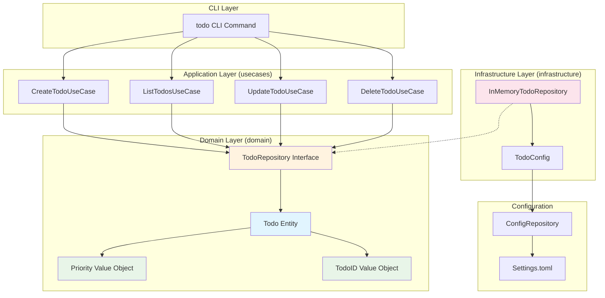
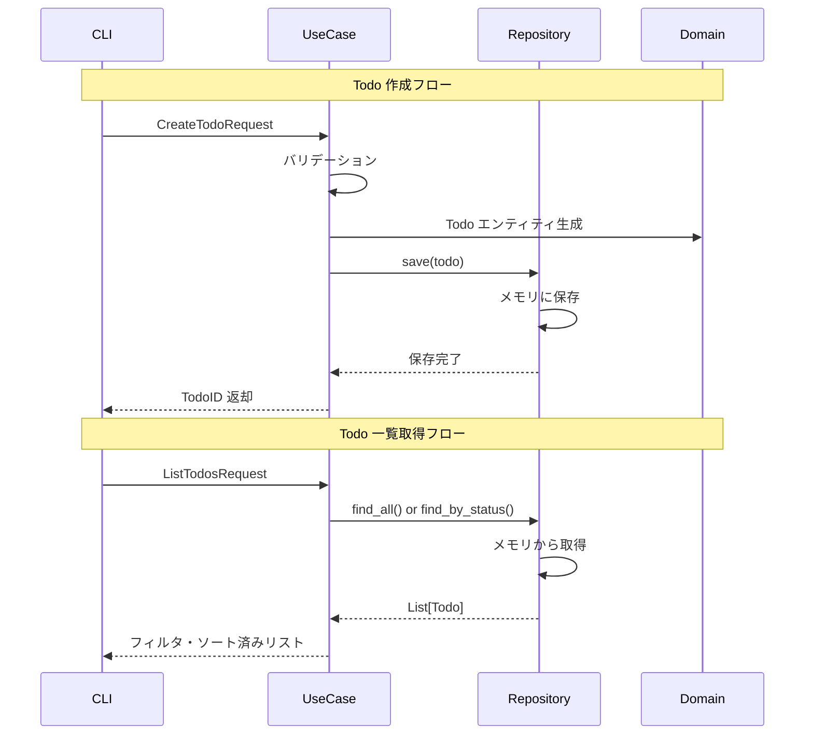

# Design: Todo サンプルモジュール

## アーキテクチャ概要

Todo サンプルモジュールは、moro プロジェクトの標準的なレイヤードアーキテクチャに従い、教育的な観点から各レイヤーの責務と実装パターンを明示します。

### 設計原則

1. **レイヤー分離**: 各レイヤーの責務を明確に分離
2. **依存性逆転**: 上位レイヤーが下位レイヤーに依存しない
3. **単一責任**: 各クラス・モジュールは単一の責務を持つ
4. **教育性重視**: コードによる学習を促進する設計

## システムアーキテクチャ



## データフロー図



## レイヤー詳細設計

### 1. Domain Layer (domain.py)

**責務**: ビジネスロジックとドメインルールの実装

```python
from dataclasses import dataclass
import dataclasses
from typing import Protocol, List, Optional, Literal
from datetime import datetime
import uuid

# 型制約による優先度表現

Priority = Literal["high", "medium", "low"]

def validate_priority(value: str) -> Priority:
    """優先度文字列をバリデーションして Priority 型を返す

    Args:
        value: 優先度文字列（大小文字区別なし）

    Returns:
        正規化された Priority 値

    Raises:
        ValueError: 不正な優先度文字列の場合

    教育的ポイント：
    - Literal 型による制約の表現
    - バリデーション関数の分離
    - 型安全性の確保
    - プロジェクト一貫性の維持
    """
    normalized = value.lower()
    if normalized in ("high", "medium", "low"):
        return normalized  # type: ignore[return-value]

    raise ValueError(f"無効な優先度: {value}. 有効な値: high, medium, low")

@dataclass(frozen=True)
class TodoID:
    """Todo の一意識別子

    設計判断：
    - プリミティブ型（str）をラップして型安全性を向上
    - ドメインの概念を明示的に表現
    - frozen=True で不変性を保証
    """
    value: str

    @classmethod
    def generate(cls) -> "TodoID":
        """新しい TodoID を生成"""
        return cls(str(uuid.uuid4()))

    def __str__(self) -> str:
        return self.value

# エンティティ - アイデンティティを持つドメインオブジェクト
@dataclass(frozen=True)
class Todo:
    """Todo エンティティ（イミュータブル）

    ドメイン設計原則：
    - 一意のID を持つ
    - イミュータブル（不変）
    - ビジネスルールをカプセル化
    - 状態変更は新しいインスタンス生成により表現

    教育的ポイント：
    - ドメインエンティティの不変性による利点
    - Repository で状態管理を隠蔽
    - 関数型プログラミング的アプローチ
    """
    id: TodoID
    title: str
    description: str
    priority: Priority
    is_completed: bool
    created_at: datetime
    updated_at: datetime

    def mark_completed(self) -> "Todo":
        """完了状態にした新しいインスタンスを返す

        Returns:
            完了状態の新しい Todo インスタンス

        ビジネスルール：
        - 既に完了済みの場合は自身を返す（変更なし）
        - 更新日時を自動更新
        """
        if self.is_completed:
            return self

        return dataclasses.replace(
            self,
            is_completed=True,
            updated_at=datetime.now()
        )

    def mark_incomplete(self) -> "Todo":
        """未完了状態にした新しいインスタンスを返す

        Returns:
            未完了状態の新しい Todo インスタンス

        ビジネスルール：
        - 既に未完了の場合は自身を返す（変更なし）
        - 更新日時を自動更新
        """
        if not self.is_completed:
            return self

        return dataclasses.replace(
            self,
            is_completed=False,
            updated_at=datetime.now()
        )

    def update_content(self, title: str, description: str, priority: Priority) -> "Todo":
        """内容を更新した新しいインスタンスを返す

        Args:
            title: 新しいタイトル
            description: 新しい説明
            priority: 新しい優先度

        Returns:
            更新された新しい Todo インスタンス

        ビジネスルール：
        - 何も変更がない場合は自身を返す（変更なし）
        - 少なくとも1つの項目が変更された場合のみ更新日時を更新
        - タイトルの空白は自動でトリム
        """
        title = title.strip()
        description = description.strip()

        # 変更の有無をチェック
        if (self.title == title and
            self.description == description and
            self.priority == priority):
            return self

        return dataclasses.replace(
            self,
            title=title,
            description=description,
            priority=priority,
            updated_at=datetime.now()
        )

    @property
    def is_high_priority(self) -> bool:
        """高優先度かどうかを判定"""
        return self.priority == "high"

# リポジトリインターフェース - データアクセスの抽象化
class TodoRepository(Protocol):
    """Todo リポジトリインターフェース

    Repository パターンの利点：
    - ドメインレイヤーをインフラから分離
    - テストでモック化が容易
    - 永続化方法を抽象化（メモリ・DB・ファイル等）

    注意：Protocol を使用することで、duck typing による
    インターフェース実装を可能にしています。
    """

    def save(self, todo: Todo) -> Todo:
        """Todo を保存し、保存されたインスタンスを返す

        Args:
            todo: 保存する Todo エンティティ

        Returns:
            保存された Todo エンティティ（同一インスタンス）
        """
        ...

    def find_by_id(self, todo_id: TodoID) -> Optional[Todo]:
        """ID で Todo を取得する

        Args:
            todo_id: 検索する TodoID

        Returns:
            見つかった Todo、存在しない場合は None
        """
        ...

    def find_all(self) -> List[Todo]:
        """全ての Todo を取得する

        Returns:
            全 Todo のリスト（空の場合は空リスト）
        """
        ...

    def find_by_completion_status(self, is_completed: bool) -> List[Todo]:
        """完了状態で Todo を検索する

        Args:
            is_completed: 検索する完了状態

        Returns:
            条件に合致する Todo のリスト
        """
        ...

    def delete(self, todo_id: TodoID) -> bool:
        """Todo を削除する

        Args:
            todo_id: 削除する TodoID

        Returns:
            削除成功時は True、対象が存在しない場合は False
        """
        ...

    def delete_completed(self) -> int:
        """完了済み Todo を一括削除する

        Returns:
            削除した Todo の件数
        """
        ...

    def count(self) -> int:
        """Todo の総数を取得する

        Returns:
            Todo の総数
        """
        ...
```

### 2. Application Layer (usecases.py)

**責務**: ユースケースの実行とドメインオブジェクトの協調

```python
from dataclasses import dataclass
from typing import List, Optional
from datetime import datetime

from .domain import Todo, TodoID, Priority, TodoRepository

# リクエスト・レスポンスオブジェクト
@dataclass
class CreateTodoRequest:
    """Todo 作成リクエスト

    設計判断：
    - プリミティブな型から適切なドメインオブジェクトへの変換を担当
    - バリデーションロジックの集約点
    """
    title: str
    description: str = ""
    priority: str = "medium"

@dataclass
class UpdateTodoRequest:
    """Todo 更新リクエスト"""
    todo_id: str
    title: Optional[str] = None
    description: Optional[str] = None
    priority: Optional[str] = None

@dataclass
class TodoResponse:
    """Todo レスポンス（表示用）

    設計判断：
    - ドメインオブジェクトをそのまま外部に公開しない
    - 必要な情報のみを含む軽量なオブジェクト
    """
    id: str
    title: str
    description: str
    priority: str
    is_completed: bool
    created_at: datetime
    updated_at: datetime

    @classmethod
    def from_domain(cls, todo: Todo) -> "TodoResponse":
        """ドメインオブジェクトから変換"""
        return cls(
            id=str(todo.id),
            title=todo.title,
            description=todo.description,
            priority=todo.priority.value,
            is_completed=todo.is_completed,
            created_at=todo.created_at,
            updated_at=todo.updated_at
        )

# ユースケース実装
class CreateTodoUseCase:
    """Todo 作成ユースケース

    ユースケースの責務：
    - ビジネスルールの実行
    - ドメインオブジェクトの協調
    - インフラストラクチャへの委譲
    """

    def __init__(self, repository: TodoRepository) -> None:
        self._repository = repository

    def execute(self, request: CreateTodoRequest) -> TodoResponse:
        """Todo を作成する

        フロー：
        1. リクエストのバリデーション
        2. ドメインオブジェクトの生成
        3. ビジネスルールの適用
        4. 永続化の実行

        Args:
            request: 作成リクエスト

        Returns:
            作成された Todo の情報

        Raises:
            ValueError: バリデーションエラー
        """
        # バリデーション（ドメインルール）
        if not request.title.strip():
            raise ValueError("タイトルは必須です")
        if len(request.title.strip()) > 100:
            raise ValueError("タイトルは100文字以内で入力してください")
        if len(request.description) > 500:
            raise ValueError("説明は500文字以内で入力してください")

        # 優先度の変換とバリデーション
        try:
            priority = validate_priority(request.priority)
        except ValueError as e:
            raise ValueError(f"優先度の指定が不正です: {e}")

        # ドメインオブジェクトの生成
        todo_id = TodoID.generate()
        now = datetime.now()

        todo = Todo(
            id=todo_id,
            title=request.title.strip(),
            description=request.description.strip(),
            priority=priority,
            is_completed=False,
            created_at=now,
            updated_at=now
        )

        # 永続化
        self._repository.save(todo)
        return TodoResponse.from_domain(todo)

class ListTodosUseCase:
    """Todo 一覧取得ユースケース"""

    def __init__(self, repository: TodoRepository) -> None:
        self._repository = repository

    def execute(self, completed_only: Optional[bool] = None,
               sort_by_priority: bool = False) -> List[TodoResponse]:
        """Todo 一覧を取得する

        Args:
            completed_only: 完了状態でフィルタ（None=全件）
            sort_by_priority: 優先度でソートするか

        Returns:
            Todo のリスト
        """
        # データ取得
        if completed_only is None:
            todos = self._repository.find_all()
        else:
            todos = self._repository.find_by_completion_status(completed_only)

        # ソート処理
        if sort_by_priority:
            # 優先度順: high -> medium -> low
            priority_order = {"high": 0, "medium": 1, "low": 2}
            todos.sort(key=lambda t: (priority_order[t.priority], t.created_at))
        else:
            # デフォルトは作成日時順（新しい順）
            todos.sort(key=lambda t: t.created_at, reverse=True)

        return [TodoResponse.from_domain(todo) for todo in todos]

class UpdateTodoUseCase:
    """Todo 更新ユースケース"""

    def __init__(self, repository: TodoRepository) -> None:
        self._repository = repository

    def execute(self, request: UpdateTodoRequest) -> TodoResponse:
        """Todo を更新する

        Args:
            request: 更新リクエスト

        Returns:
            更新された Todo の情報

        Raises:
            ValueError: バリデーションエラーまたは Todo が存在しない
        """
        # 存在確認
        todo_id = TodoID(request.todo_id)
        todo = self._repository.find_by_id(todo_id)
        if todo is None:
            raise ValueError(f"指定された Todo が見つかりません: {request.todo_id}")

        # 更新データの準備
        title = request.title if request.title is not None else todo.title
        description = request.description if request.description is not None else todo.description
        priority = (validate_priority(request.priority)
                   if request.priority is not None else todo.priority)

        # バリデーション
        if not title.strip():
            raise ValueError("タイトルは必須です")
        if len(title.strip()) > 100:
            raise ValueError("タイトルは100文字以内で入力してください")
        if len(description) > 500:
            raise ValueError("説明は500文字以内で入力してください")

        # 更新実行（イミュータブルパターン）
        updated_todo = todo.update_content(title, description, priority)
        saved_todo = self._repository.save(updated_todo)

        return TodoResponse.from_domain(saved_todo)

class ToggleTodoUseCase:
    """Todo 完了状態切り替えユースケース"""

    def __init__(self, repository: TodoRepository) -> None:
        self._repository = repository

    def execute(self, todo_id: str) -> TodoResponse:
        """Todo の完了状態を切り替える

        Args:
            todo_id: 対象の TodoID

        Returns:
            更新された Todo の情報

        Raises:
            ValueError: Todo が存在しない
        """
        todo_id_obj = TodoID(todo_id)
        todo = self._repository.find_by_id(todo_id_obj)
        if todo is None:
            raise ValueError(f"指定された Todo が見つかりません: {todo_id}")

        # 状態切り替え（イミュータブルパターン）
        updated_todo = (
            todo.mark_incomplete() if todo.is_completed
            else todo.mark_completed()
        )

        saved_todo = self._repository.save(updated_todo)
        return TodoResponse.from_domain(saved_todo)

class DeleteTodoUseCase:
    """Todo 削除ユースケース"""

    def __init__(self, repository: TodoRepository) -> None:
        self._repository = repository

    def execute(self, todo_id: str) -> bool:
        """Todo を削除する

        Args:
            todo_id: 削除する TodoID

        Returns:
            削除成功時は True、存在しない場合は False
        """
        todo_id_obj = TodoID(todo_id)
        return self._repository.delete(todo_id_obj)

    def delete_completed(self) -> int:
        """完了済み Todo を一括削除する

        Returns:
            削除した Todo の件数
        """
        return self._repository.delete_completed()
```

### 3. Infrastructure Layer (infrastructure.py)

**責務**: 外部システムとの統合、データ永続化

```python
from typing import Dict, List, Optional
from pydantic import BaseModel, Field

from .domain import Todo, TodoID, TodoRepository

class TodoConfig(BaseModel):
    """Todo モジュールの設定

    Pydantic による設定管理の例：
    - 型安全性の確保
    - バリデーション機能
    - 設定ファイルとの自動連携
    """
    max_todos: int = Field(default=1000, ge=1, le=10000,
                          description="最大 Todo 保存件数")
    auto_cleanup_days: int = Field(default=30, ge=1, le=365,
                                  description="完了済み Todo の自動削除日数")
    default_priority: str = Field(default="medium",
                                 pattern="^(high|medium|low)$",
                                 description="デフォルト優先度")

class InMemoryTodoRepository:
    """メモリ内 Todo リポジトリ実装

    Repository パターンの実装例：
    - インターフェース（Protocol）に準拠
    - メモリ内辞書による永続化（開発・テスト用）
    - 実際のプロダクトでは DB 実装に置き換え可能
    """

    def __init__(self, config: TodoConfig) -> None:
        self._todos: Dict[str, Todo] = {}
        self._config = config

    def save(self, todo: Todo) -> Todo:
        """Todo を保存し、保存されたインスタンスを返す

        Args:
            todo: 保存する Todo エンティティ

        Returns:
            保存された Todo エンティティ（同一インスタンス）

        実装詳細：
        - メモリ内辞書に保存
        - 最大件数チェック
        - 既存の場合は上書き更新
        - イミュータブルエンティティをそのまま保存

        教育的ポイント：
        - Repository がドメインエンティティの不変性を尊重
        - 保存処理は副作用なし（エンティティ自体は変更されない）
        """
        # 最大件数チェック（新規追加の場合のみ）
        if (str(todo.id) not in self._todos and
            len(self._todos) >= self._config.max_todos):
            raise ValueError(f"最大 Todo 件数（{self._config.max_todos}）に達しています")

        self._todos[str(todo.id)] = todo
        return todo

    def find_by_id(self, todo_id: TodoID) -> Optional[Todo]:
        """ID で Todo を取得する"""
        return self._todos.get(str(todo_id))

    def find_all(self) -> List[Todo]:
        """全ての Todo を取得する"""
        return list(self._todos.values())

    def find_by_completion_status(self, is_completed: bool) -> List[Todo]:
        """完了状態で Todo を検索する"""
        return [todo for todo in self._todos.values()
                if todo.is_completed == is_completed]

    def delete(self, todo_id: TodoID) -> bool:
        """Todo を削除する"""
        if str(todo_id) in self._todos:
            del self._todos[str(todo_id)]
            return True
        return False

    def delete_completed(self) -> int:
        """完了済み Todo を一括削除する"""
        completed_ids = [str(todo.id) for todo in self._todos.values()
                        if todo.is_completed]

        for todo_id in completed_ids:
            del self._todos[todo_id]

        return len(completed_ids)

    def count(self) -> int:
        """Todo の総数を取得する"""
        return len(self._todos)

    def clear(self) -> None:
        """全ての Todo を削除する（テスト用）"""
        self._todos.clear()
```

### 4. Configuration Layer (config.py)

**責務**: 設定管理と DI コンテナへの登録

```python
from pydantic import BaseModel

from .infrastructure import TodoConfig

class TodoModuleConfig(BaseModel):
    """Todo モジュール全体の設定

    ConfigRepository への登録用設定クラス
    """
    todo: TodoConfig = TodoConfig()
```
