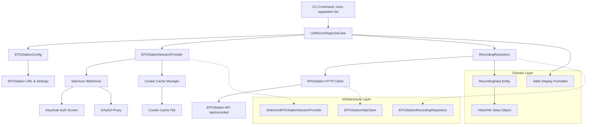
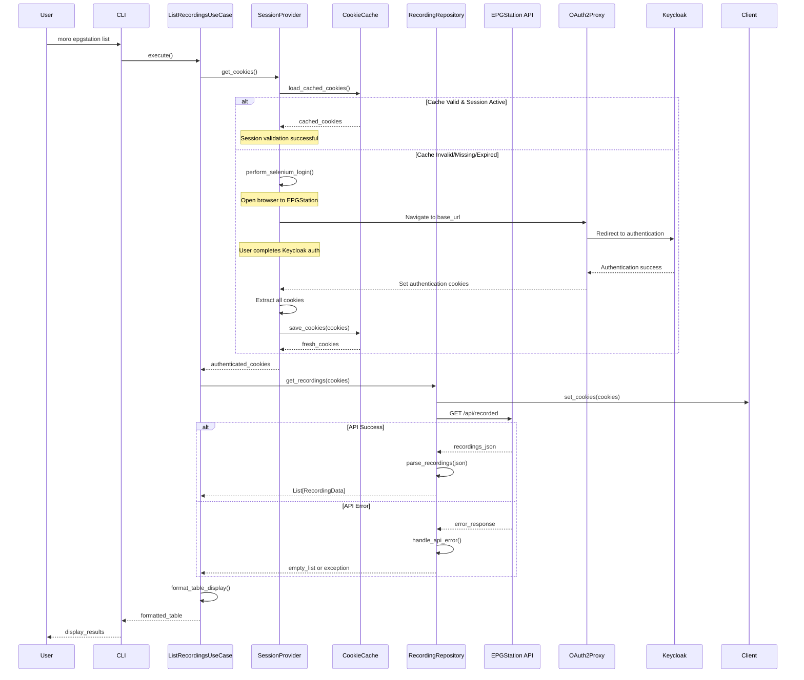

# EPGStation 録画データ管理クライアント機能 - システム設計

## アーキテクチャ概要

EPGStation クライアント機能は、既存の moro アーキテクチャパターンに従い、Clean Architecture + Domain-Driven Design の原則で設計される。fantia モジュールの成功したパターンを踏襲し、Selenium 認証・Cookie キャッシュ・Repository パターンを活用する。

## システムアーキテクチャ図



## データフロー設計



## モジュール構造設計

### ディレクトリ構造

```text
src/moro/modules/epgstation/
├── __init__.py
├── config.py           # 設定管理（EPGStationConfig）
├── domain.py           # ドメインエンティティ・値オブジェクト
├── infrastructure.py   # 外部システム連携実装
└── usecases.py        # ビジネスロジック・ユースケース
```

### レイヤー責務

- **config.py**: Pydantic による設定管理、環境変数対応
- **domain.py**: ドメインエンティティ、Repository インターフェース定義
- **infrastructure.py**: Selenium 認証、HTTP クライアント、Repository 実装
- **usecases.py**: ビジネスロジック、表示フォーマット処理

## ドメインモデル設計

### エンティティ・値オブジェクト

```python
from pydantic import BaseModel, Field
from typing import Annotated, List
from enum import Enum
from datetime import datetime

class VideoFileType(str, Enum):
    """ビデオファイル種別"""
    TS = "ts"
    ENCODED = "encoded"

class VideoFile(BaseModel):
    """ビデオファイル値オブジェクト"""
    id: Annotated[int, Field(description="ビデオファイルID")]
    name: Annotated[str, Field(description="表示名")]
    filename: Annotated[str, Field(description="ファイル名")]
    type: Annotated[VideoFileType, Field(description="ファイル種別")]
    size: Annotated[int, Field(description="ファイルサイズ（バイト）")]

    @property
    def formatted_size(self) -> str:
        """ファイルサイズを適切な単位で表示"""
        if self.size < 1024:
            return f"{self.size}B"
        elif self.size < 1024 ** 2:
            return f"{self.size / 1024:.1f}KB"
        elif self.size < 1024 ** 3:
            return f"{self.size / (1024 ** 2):.1f}MB"
        else:
            return f"{self.size / (1024 ** 3):.2f}GB"

class RecordingData(BaseModel):
    """録画データエンティティ"""
    id: Annotated[int, Field(description="録画ID")]
    name: Annotated[str, Field(description="番組タイトル")]
    start_at: Annotated[int, Field(description="開始時刻（Unix timestamp ms）")]
    end_at: Annotated[int, Field(description="終了時刻（Unix timestamp ms）")]
    video_files: Annotated[List[VideoFile], Field(description="ビデオファイル一覧")]
    is_recording: Annotated[bool, Field(description="録画中かどうか")]
    is_protected: Annotated[bool, Field(description="自動削除対象外か")]

    @property
    def formatted_start_time(self) -> str:
        """開始時刻の表示用フォーマット"""
        return datetime.fromtimestamp(self.start_at / 1000).strftime("%Y-%m-%d %H:%M")

    @property
    def duration_minutes(self) -> int:
        """録画時間（分）"""
        return (self.end_at - self.start_at) // (1000 * 60)
```

### Repository インターフェース

```python
from typing import Protocol, Dict, List

class EPGStationSessionProvider(Protocol):
    """EPGStation 認証セッション提供者"""

    def get_cookies(self) -> Dict[str, str]:
        """認証済み Cookie を取得

        Returns:
            認証済み Cookie 辞書

        Raises:
            AuthenticationError: 認証に失敗した場合
        """
        ...

class RecordingRepository(Protocol):
    """録画データリポジトリ"""

    def get_all(self, limit: int = 1000, offset: int = 0) -> List[RecordingData]:
        """全録画データを取得

        Args:
            limit: 取得最大件数
            offset: 取得開始位置

        Returns:
            録画データリスト

        Raises:
            APIError: API アクセスに失敗した場合
        """
        ...
```

## 設定管理設計

### EPGStationConfig

```python
from pydantic import BaseModel, Field, validator
import re

class EPGStationConfig(BaseModel):
    """EPGStation設定"""

    # 基本設定
    base_url: str = Field(
        ...,
        description="EPGStation ベースURL（例: https://epgstation.example.com）"
    )

    # Selenium設定
    chrome_data_dir: str = Field(
        default="epgstation_chrome_userdata",
        description="Chrome ユーザーデータディレクトリ"
    )

    # Cookie キャッシュ設定
    enable_cookie_cache: bool = Field(
        default=True,
        description="Cookie キャッシュを有効にするか"
    )
    cookie_cache_file: str = Field(
        default="epgstation_cookies.json",
        description="Cookie キャッシュファイル名"
    )
    cookie_cache_ttl: int = Field(
        default=3600,
        description="Cookie キャッシュ有効期限（秒）"
    )

    # HTTP設定
    timeout: float = Field(
        default=30.0,
        ge=1.0,
        description="HTTP タイムアウト（秒）"
    )
    max_retries: int = Field(
        default=3,
        ge=0,
        description="最大リトライ回数"
    )

    # 表示設定
    max_recordings: int = Field(
        default=1000,
        ge=1,
        le=10000,
        description="最大表示録画数"
    )

    @validator('base_url')
    def validate_base_url(cls, v: str) -> str:
        """ベースURL の検証"""
        if not re.match(r'^https?://[^\s/$.?#].[^\s]*$', v):
            raise ValueError('有効なURL形式ではありません')
        return v.rstrip('/')
```

## インフラストラクチャ設計

### Selenium 認証プロバイダー

```python
@inject
class SeleniumEPGStationSessionProvider(EPGStationSessionProvider):
    """Selenium ベースの EPGStation セッション認証"""

    def __init__(
        self,
        config: CommonConfig,
        epgstation_config: EPGStationConfig
    ) -> None:
        self._config = config
        self._epgstation_config = epgstation_config
        self._chrome_user_data = path.join(
            config.user_cache_dir,
            epgstation_config.chrome_data_dir
        )
        self._cookie_cache_file = path.join(
            config.user_cache_dir,
            epgstation_config.cookie_cache_file
        )

    def get_cookies(self) -> Dict[str, str]:
        """認証済み Cookie を取得（キャッシュ機能付き）"""
        # キャッシュから読み込み
        cached_cookies = self._load_cached_cookies()
        if cached_cookies and self._is_session_valid(cached_cookies):
            logger.info("Using cached EPGStation cookies")
            return cached_cookies

        # 新規認証実行
        logger.info("Performing fresh EPGStation authentication")
        fresh_cookies = self._perform_selenium_login()

        # キャッシュに保存
        if fresh_cookies:
            self._save_cookies_to_cache(fresh_cookies)

        return fresh_cookies

    def _perform_selenium_login(self) -> Dict[str, str]:
        """Selenium による認証実行"""
        options = self._create_chrome_options()

        with webdriver.Chrome(options=options) as driver:
            # EPGStation トップページにアクセス
            driver.get(self._epgstation_config.base_url)

            # OAuth2-Proxy → Keycloak リダイレクト待機
            while True:
                current_url = driver.current_url

                # 認証完了判定（EPGStation ページに戻った）
                if self._is_authenticated_page(current_url):
                    # 全 Cookie を取得
                    cookies = driver.get_cookies()
                    result = {
                        cookie["name"]: cookie["value"]
                        for cookie in cookies
                    }
                    logger.info(f"Obtained {len(result)} cookies")
                    return result

                time.sleep(1)
```

### HTTP クライアント・Repository

```python
@inject
class EPGStationRecordingRepository(RecordingRepository):
    """EPGStation 録画データリポジトリ実装"""

    def __init__(
        self,
        session_provider: EPGStationSessionProvider,
        epgstation_config: EPGStationConfig
    ) -> None:
        self._session_provider = session_provider
        self._config = epgstation_config
        self._client = httpx.Client(
            base_url=epgstation_config.base_url,
            timeout=epgstation_config.timeout
        )

    def get_all(self, limit: int = 1000, offset: int = 0) -> List[RecordingData]:
        """録画データ一覧を取得"""
        cookies = self._session_provider.get_cookies()

        params = {
            "limit": min(limit, self._config.max_recordings),
            "offset": offset,
            "isHalfWidth": True  # 半角文字で取得
        }

        response = self._client.get(
            "/api/recorded",
            cookies=cookies,
            params=params
        )
        response.raise_for_status()

        data = response.json()
        recordings = []

        for item in data.get("records", []):
            video_files = [
                VideoFile(
                    id=vf["id"],
                    name=vf["name"],
                    filename=vf.get("filename", ""),
                    type=VideoFileType(vf["type"]),
                    size=vf["size"]
                )
                for vf in item.get("videoFiles", [])
            ]

            recording = RecordingData(
                id=item["id"],
                name=item["name"],
                start_at=item["startAt"],
                end_at=item["endAt"],
                video_files=video_files,
                is_recording=item["isRecording"],
                is_protected=item["isProtected"]
            )
            recordings.append(recording)

        return recordings
```

## ユースケース設計

### 録画一覧取得ユースケース

```python
@inject
class ListRecordingsUseCase:
    """録画一覧取得ユースケース"""

    def __init__(self, recording_repository: RecordingRepository) -> None:
        self._repository = recording_repository

    def execute(self, limit: int = 1000) -> str:
        """録画一覧を取得してテーブル形式で返す"""
        try:
            recordings = self._repository.get_all(limit=limit)
            return self._format_table(recordings)
        except Exception as e:
            logger.error(f"Failed to get recordings: {e}")
            return f"エラー: 録画一覧の取得に失敗しました ({e})"

    def _format_table(self, recordings: List[RecordingData]) -> str:
        """録画データをテーブル形式でフォーマット"""
        if not recordings:
            return "録画データが見つかりませんでした。"

        headers = ["録画ID", "タイトル", "開始時刻", "ファイル名", "種別", "サイズ"]
        rows = []

        for recording in recordings:
            if not recording.video_files:
                # ビデオファイルがない場合
                rows.append([
                    str(recording.id),
                    recording.name[:40],  # タイトル長制限
                    recording.formatted_start_time,
                    "N/A",
                    "N/A",
                    "N/A"
                ])
            else:
                # 各ビデオファイルを個別行として表示
                for video_file in recording.video_files:
                    rows.append([
                        str(recording.id),
                        recording.name[:40],
                        recording.formatted_start_time,
                        video_file.filename or video_file.name,
                        video_file.type.upper(),
                        video_file.formatted_size
                    ])

        return self._create_table(headers, rows)
```

## CLI 統合設計

```python
# cli/epgstation.py
import click
from moro.dependencies import get_injector

@click.group()
def epgstation():
    """EPGStation 録画管理コマンド"""
    pass

@epgstation.command()
@click.option(
    "--limit",
    default=100,
    help="表示する録画数の上限（デフォルト: 100）"
)
def list(limit: int):
    """録画一覧を表示"""
    injector = get_injector()
    use_case = injector.get(ListRecordingsUseCase)
    result = use_case.execute(limit=limit)
    click.echo(result)
```

この設計で進めますか？

**次に進んで** → `design.md` 生成後、Implementation Phase へ
**修正して** → 設計内容の調整・改善
**詳しく説明して** → 特定部分の詳細説明
