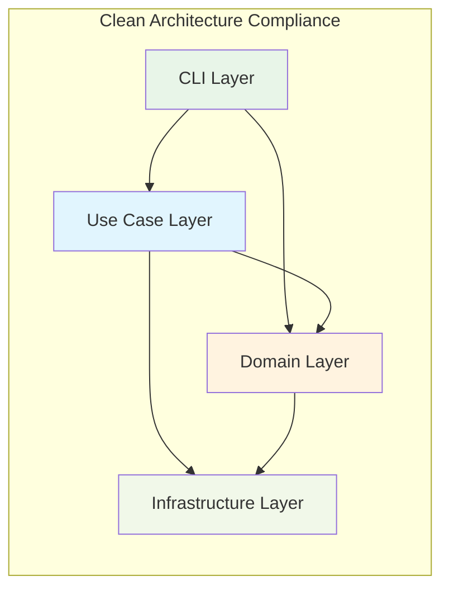
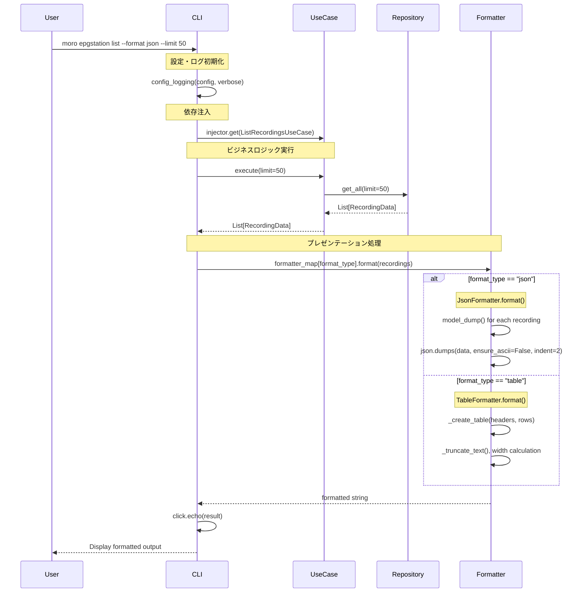
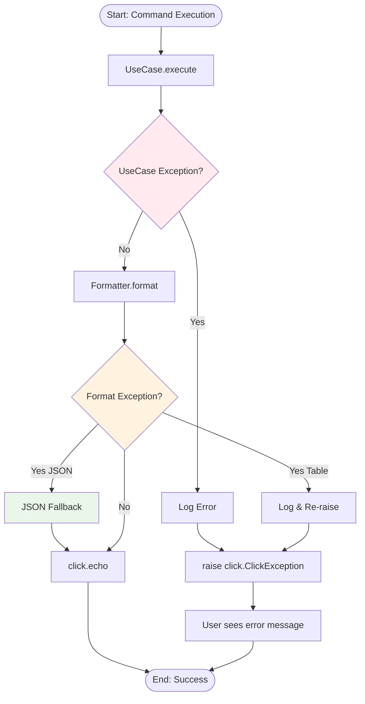

# EPGStation 責務分離 - 設計書

**仕様書バージョン**: 1.0
**作成日**: 2025-08-11
**対象モジュール**: `src/moro/modules/epgstation/`, `src/moro/cli/epgstation.py`

## 設計概要

Clean Architecture原則に従い、ユースケース層（ビジネスロジック）とプレゼンテーション層を完全分離。CLIレイヤー内にStrategy パターンによるフォーマッター実装を配置し、TableとJSONの複数出力形式に対応する。

## アーキテクチャ設計

### レイヤー構成

```
┌─────────────────────────────┐
│      CLI Layer              │  ← プレゼンテーション統合
│  - Click Commands           │
│  - OutputFormatter          │
│  - TableFormatter           │
│  - JsonFormatter            │
└─────────────────────────────┘
               │
┌─────────────────────────────┐
│    Use Case Layer           │  ← 純粋ビジネスロジック
│  - ListRecordingsUseCase    │
└─────────────────────────────┘
               │
┌─────────────────────────────┐
│    Domain Layer             │
│  - RecordingData            │
│  - VideoFile                │
│  - RecordingRepository      │
└─────────────────────────────┘
               │
┌─────────────────────────────┐
│  Infrastructure Layer       │
│  - EPGStation API Client    │
└─────────────────────────────┘
```

### 依存関係の方向



## コンポーネント設計

### 1. ユースケース層（改修後）

**責務**: 純粋なビジネスロジックのみ

```python
# modules/epgstation/usecases.py
@inject
class ListRecordingsUseCase:
    """録画一覧取得ユースケース（純粋ビジネスロジック）"""

    def __init__(self, recording_repository: RecordingRepository) -> None:
        self._repository = recording_repository

    def execute(self, limit: int = 100) -> List[RecordingData]:
        """録画一覧を取得

        Returns:
            List[RecordingData]: ドメインオブジェクトのリスト
        Raises:
            Exception: ビジネス例外をそのまま上位に委譲
        """
        try:
            return self._repository.get_all(limit=limit)
        except Exception as e:
            logger.error(f"Failed to get recordings: {e}")
            raise  # プレゼンテーション層で処理
```

**変更点**:

- 戻り値: `str` → `List[RecordingData]`
- 責務: フォーマット処理を完全除去
- 行数: 35行 → 15行（品質向上）

### 2. プレゼンテーション層（新規）

**責務**: 出力フォーマット処理、CLIレイヤー内実装

#### Strategy Pattern 実装

```python
# cli/epgstation.py に実装
class OutputFormatter(ABC):
    """出力フォーマットの抽象基底クラス"""

    @abstractmethod
    def format(self, recordings: List[RecordingData]) -> str:
        """録画データを指定形式でフォーマット"""

    @abstractmethod
    def format_empty_message(self) -> str:
        """データが空の場合のメッセージ"""
```

#### 具体実装クラス

**TableFormatter**:

```python
class TableFormatter(OutputFormatter):
    """テーブル形式フォーマッター"""

    def format(self, recordings: List[RecordingData]) -> str:
        """既存のテーブル整形ロジックを移植"""
        # - _format_table() ロジック
        # - _create_table() ロジック
        # - _truncate_text() ロジック
        # 全て移行し、責務を明確化

    def format_empty_message(self) -> str:
        return "録画データが見つかりませんでした。"
```

**JsonFormatter**:

```python
class JsonFormatter(OutputFormatter):
    """JSON形式フォーマッター"""

    def format(self, recordings: List[RecordingData]) -> str:
        """JSON形式でのフォーマット（堅牢性重視）"""
        try:
            data = [recording.model_dump() for recording in recordings]
            return json.dumps(data, ensure_ascii=False, indent=2)
        except Exception as e:
            # フォールバック: 基本情報のみのJSON
            fallback_data = [
                {
                    "id": recording.id,
                    "name": recording.name,
                    "start_time": recording.formatted_start_time,
                    "error": "詳細情報の取得に失敗"
                } for recording in recordings
            ]
            return json.dumps(fallback_data, ensure_ascii=False, indent=2)

    def format_empty_message(self) -> str:
        return json.dumps({
            "recordings": [],
            "message": "録画データが見つかりませんでした。"
        }, ensure_ascii=False, indent=2)
```

### 3. CLI統合層（改修後）

**責務**: コマンドライン処理、ビジネスロジックとプレゼンテーション層の統合

```python
@epgstation.command(name="list")
@click.option("--limit", default=100, type=int,
              help="表示する録画数の上限（デフォルト: 100）")
@click.option("--format", "format_type",
              type=click.Choice(['table', 'json']),
              default='table',
              help="出力形式（デフォルト: table）")
@click_verbose_option
def list_recordings(limit: int, format_type: str, verbose: tuple[bool]) -> None:
    """録画一覧を表示"""
    config = ConfigRepository.create()
    config_logging(config, verbose)

    try:
        # 依存注入でユースケース取得
        injector = create_injector(config)
        use_case = injector.get(ListRecordingsUseCase)

        # ビジネスロジック実行
        recordings = use_case.execute(limit=limit)

        # プレゼンテーション処理
        formatter_map = {
            'table': TableFormatter(),
            'json': JsonFormatter()
        }
        formatter = formatter_map[format_type]

        # フォーマットして出力
        result = formatter.format(recordings)
        click.echo(result)

    except Exception as e:
        logger.error(f"Command execution failed: {e}")
        raise click.ClickException(str(e)) from e
```

**変更点**:

- 新規オプション: `--format [table|json]`
- デフォルト: `table` （既存動作維持）
- エラーハンドリング: レイヤー別責務分離

## データフロー設計

### 実行シーケンス



### エラー処理フロー



## インターフェース設計

### CLI インターフェース

#### 既存互換性（後方互換）

```bash
# 既存コマンド（動作変更なし）
moro epgstation list
moro epgstation list --limit 50
moro epgstation list --verbose

# 出力形式: Table（既存と同一）
┌──────────┬──────────────┬──────────────┬──────────────┬──────┬────────┐
│ 録画ID   │ タイトル     │ 開始時刻     │ ファイル名   │ 種別 │ サイズ │
├──────────┼──────────────┼──────────────┼──────────────┼──────┼────────┤
│ 12345    │ 番組名...    │ 2025-08-11   │ program.ts   │ TS   │ 1.2GB  │
└──────────┴──────────────┴──────────────┴──────────────┴──────┴────────┘
```

#### 新機能（JSON対応）

```bash
# JSON形式出力
moro epgstation list --format json
moro epgstation list --format json --limit 10

# 出力形式: JSON
{
  "recordings": [
    {
      "id": 12345,
      "name": "番組名",
      "start_at": 1691683200000,
      "end_at": 1691686800000,
      "video_files": [
        {
          "id": 1,
          "name": "program.ts",
          "filename": "program.ts",
          "type": "ts",
          "size": 1234567890
        }
      ],
      "is_recording": false,
      "is_protected": false
    }
  ]
}

# 空データの場合
{
  "recordings": [],
  "message": "録画データが見つかりませんでした。"
}
```

#### エラーメッセージ

```bash
# 無効なフォーマット指定
$ moro epgstation list --format xml
Usage: moro epgstation list [OPTIONS]
Try 'moro epgstation list --help' for help.

Error: Invalid value for '--format': invalid choice: xml. (choose from table, json)

# ビジネスエラー
$ moro epgstation list
Error: 録画一覧の取得に失敗しました (Connection timeout)
```

### プログラマティック インターフェース

#### ユースケース インターフェース（変更後）

```python
# Before: 文字列を返却（責務混在）
def execute(self, limit: int = 100) -> str:
    recordings = self._repository.get_all(limit=limit)
    return self._format_table(recordings)  # ❌ プレゼンテーション処理

# After: ドメインオブジェクトを返却（責務分離）
def execute(self, limit: int = 100) -> List[RecordingData]:
    return self._repository.get_all(limit=limit)  # ✅ ビジネスロジックのみ
```

#### フォーマッター インターフェース（新規）

```python
# 抽象インターフェース
class OutputFormatter(ABC):
    @abstractmethod
    def format(self, recordings: List[RecordingData]) -> str: ...

    @abstractmethod
    def format_empty_message(self) -> str: ...

# 使用例
formatter = JsonFormatter()
json_output = formatter.format(recordings)

formatter = TableFormatter()
table_output = formatter.format(recordings)
```

## 非機能設計

### パフォーマンス設計

#### レスポンス時間目標

| 項目               | 現在 | 目標 | 許容上限 |
| ------------------ | ---- | ---- | -------- |
| Table形式（100件） | 50ms | 50ms | 60ms     |
| JSON形式（100件）  | -    | 40ms | 50ms     |
| オーバーヘッド     | -    | <5ms | 10ms     |

#### メモリ使用量

| 項目                 | 現在 | 目標 | 許容上限 |
| -------------------- | ---- | ---- | -------- |
| ベースメモリ         | 20MB | 20MB | 24MB     |
| Strategy実装         | -    | +2MB | +4MB     |
| 大量データ（1000件） | 40MB | 45MB | 50MB     |

### 堅牢性設計

#### エラー耐性

**JSON シリアライゼーション失敗対応**:

```python
# 堅牢性設計: フォールバック機能
try:
    return json.dumps([r.model_dump() for r in recordings], ...)
except Exception as e:
    logger.error(f"JSON serialization failed: {e}")
    # フォールバック: 基本情報のみ
    fallback = [{"id": r.id, "name": r.name, "error": "詳細取得失敗"}
                for r in recordings]
    return json.dumps(fallback, ...)
```

**大量データ対応**:

- メモリ効率: 逐次処理によるメモリピーク抑制
- タイムアウト: 長時間処理の中断機能
- プログレス: 大量データ処理時の進捗表示（将来拡張）

### セキュリティ設計

#### データ保護

**出力データサニタイゼーション**:

- JSON出力時の適切なエスケープ（`ensure_ascii=False` 使用）
- テーブル出力時の制御文字除去
- ログ出力時の機密情報マスキング

**入力バリデーション**:

- `limit` パラメーター範囲チェック（既存Repository責務）
- `format_type` 値検証（Click Choice による自動実装）

## 拡張性設計

### 新フォーマット追加

**拡張コスト**: 新フォーマッター1つあたり < 50行

```python
# CSV フォーマッター追加例（将来拡張）
class CsvFormatter(OutputFormatter):
    def format(self, recordings: List[RecordingData]) -> str:
        import csv
        from io import StringIO

        output = StringIO()
        writer = csv.writer(output)
        writer.writerow(['ID', 'タイトル', '開始時刻', 'ファイル数'])

        for recording in recordings:
            writer.writerow([
                recording.id,
                recording.name,
                recording.formatted_start_time,
                len(recording.video_files)
            ])

        return output.getvalue()

    def format_empty_message(self) -> str:
        return "ID,タイトル,開始時刻,ファイル数\n# データなし"

# CLI統合（1行追加のみ）
formatter_map = {
    'table': TableFormatter(),
    'json': JsonFormatter(),
    'csv': CsvFormatter(),  # ← 追加
}
```

### 設定ベース拡張

**デフォルトフォーマット変更**:

```python
# 将来の設定ファイル対応
@click.option("--format", "format_type",
              default=config.get('epgstation.default_format', 'table'))
```

**フィルタリング機能追加**:

```python
# ビジネスロジック拡張（ユースケース層）
def execute(self, limit: int = 100,
            filter_recording: bool = False) -> List[RecordingData]:
    recordings = self._repository.get_all(limit=limit)
    if filter_recording:
        recordings = [r for r in recordings if r.is_recording]
    return recordings
```

## 品質設計

### テスタビリティ

#### 単体テスト設計

**ユースケース テスト**:

```python
def test_list_recordings_use_case_returns_recordings():
    # Given
    mock_repo = Mock(spec=RecordingRepository)
    expected = [RecordingData(id=1, name="test", ...)]
    mock_repo.get_all.return_value = expected

    use_case = ListRecordingsUseCase(mock_repo)

    # When
    result = use_case.execute()

    # Then
    assert result == expected
    mock_repo.get_all.assert_called_once_with(limit=100)
```

**フォーマッター テスト**:

```python
def test_table_formatter_formats_correctly():
    # Given
    recordings = [RecordingData(...)]
    formatter = TableFormatter()

    # When
    result = formatter.format(recordings)

    # Then
    assert "録画ID" in result
    assert "│" in result  # テーブル区切り文字

def test_json_formatter_produces_valid_json():
    # Given
    recordings = [RecordingData(...)]
    formatter = JsonFormatter()

    # When
    result = formatter.format(recordings)

    # Then
    import json
    parsed = json.loads(result)  # バリデーション
    assert isinstance(parsed, list)
    assert len(parsed) == 1
```

#### 統合テスト設計

**E2E テスト**:

```python
def test_cli_table_output_integration():
    # Given: モック化されたEPGStation API
    with patch('moro.modules.epgstation.infrastructure.EPGStationClient'):
        # When: CLIコマンド実行
        result = runner.invoke(list_recordings, ['--format', 'table'])

        # Then: テーブル形式出力検証
        assert result.exit_code == 0
        assert "録画ID" in result.output
```

### 保守性指標

#### コードメトリクス目標

| メトリクス       | 現在 | 目標 | 品質ゲート |
| ---------------- | ---- | ---- | ---------- |
| 循環的複雑度     | 8    | 3-4  | <10        |
| メソッド行数     | 35   | <15  | <20        |
| クラス責任数     | 4    | 1    | 1          |
| テストカバレッジ | 困難 | >95% | >90%       |

#### 品質チェックポイント

**コード品質**:

- [ ] Ruff: 全チェックパス（行長100文字、import順序等）
- [ ] MyPy: 厳格モード全チェックパス
- [ ] テストカバレッジ > 95%

**アーキテクチャ品質**:

- [ ] 依存関係方向検証（Clean Architecture準拠）
- [ ] レイヤー間結合度測定
- [ ] 単一責任原則準拠確認

**互換性品質**:

- [ ] 既存CLIコマンド動作確認
- [ ] 出力形式後方互換性確認
- [ ] エラーメッセージ一貫性確認
