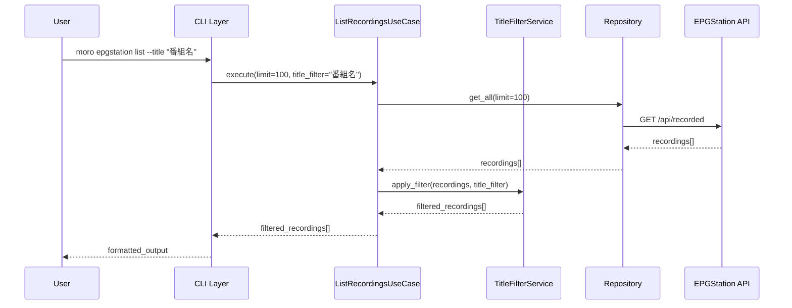
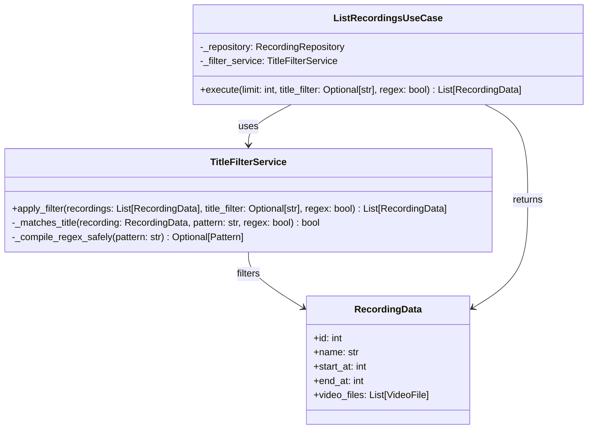

# EPGStation タイトルフィルター機能 - 設計書

## アーキテクチャ概要

既存のレイヤードアーキテクチャ + 依存性注入パターンを維持し、クリーンアーキテクチャ原則に準拠してフィルター機能を統合します。

### 既存システム分析

**現在の構造:**

```
cli/epgstation.py          # CLI レイヤー
├── usecases.py           # ビジネスロジック
├── domain.py             # エンティティ・プロトコル
└── infrastructure.py     # 外部システム連携
```

**使用技術スタック:**

- CLI: Click
- DI: Injector
- HTTP Client: httpx
- フォーマット: table2ascii, JSON
- バリデーション: Pydantic

## 設計判断と根拠

### 1. フィルター処理の配置

**選択: Domain層にTitleFilterServiceを追加**

**根拠:**

- フィルタリングは純粋なビジネスロジック
- 外部依存なしでテスタブル
- 再利用可能な設計

**代替案と却下理由:**

- ❌ CLI層でフィルター: 責務の混在
- ❌ Infrastructure層: ドメインロジックの混入

### 2. フィルター方式

**選択: メモリ内フィルタリング**

**根拠:**

- EPGStation API にフィルター機能なし
- 1000件程度のデータならメモリ処理で十分
- シンプルで保守しやすい

## Mermaid図による詳細設計

### システムアーキテクチャ

```mermaid
graph TB
    CLI[CLI Layer<br/>epgstation.py] --> UseCase[UseCase Layer<br/>ListRecordingsUseCase]
    UseCase --> Filter[Domain Service<br/>TitleFilterService]
    UseCase --> Repo[Repository<br/>EPGStationRecordingRepository]

    subgraph "新機能追加"
        NewCLI[CLI Options<br/>--title, --regex]
        FilterService[TitleFilterService<br/>+ apply_filter()]
        UpdatedUseCase[ListRecordingsUseCase<br/>+ filter_title]
    end

    NewCLI -.-> CLI
    FilterService -.-> Filter
    UpdatedUseCase -.-> UseCase

    Filter --> Domain[Domain Models<br/>RecordingData]
    Repo --> Infra[Infrastructure<br/>httpx + Selenium]
```

### データフロー設計



### クラス設計



## TypeScript風インターフェース定義

```python
# Domain Service Interface
class TitleFilterService:
    """番組タイトルフィルタリング サービス"""

    def apply_filter(
        self,
        recordings: list[RecordingData],
        title_filter: str | None = None,
        regex: bool = False
    ) -> list[RecordingData]:
        """録画データをタイトルでフィルタリング

        Args:
            recordings: フィルタリング対象の録画データ
            title_filter: フィルター条件（None の場合はフィルタリングしない）
            regex: 正規表現モードフラグ

        Returns:
            フィルタリング後の録画データリスト

        Raises:
            ValueError: 無効な正規表現パターンが指定された場合
        """

# Updated UseCase Interface
class ListRecordingsUseCase:
    """録画一覧取得ユースケース（フィルター機能付き）"""

    def __init__(
        self,
        recording_repository: RecordingRepository,
        title_filter_service: TitleFilterService
    ) -> None: ...

    def execute(
        self,
        limit: int = 100,
        title_filter: str | None = None,
        regex: bool = False
    ) -> list[RecordingData]:
        """録画一覧を取得・フィルタリング"""

# CLI Interface Extension
@click.option("--title", help="番組タイトルでフィルタリング")
@click.option("--regex/--no-regex", default=False, help="正規表現モード")
def list_recordings(
    limit: int,
    format_type: str,
    verbose: tuple[bool],
    title: str | None = None,
    regex: bool = False
) -> None:
    """録画一覧を表示（フィルター機能付き）"""
```

## パフォーマンス最適化設計

### 1. フィルタリング効率

```python
# 最適化されたフィルタリング実装案
def apply_filter(self, recordings: list[RecordingData], title_filter: str | None, regex: bool) -> list[RecordingData]:
    if not title_filter:
        return recordings

    if regex:
        # 正規表現コンパイルは一度のみ
        pattern = self._compile_regex_safely(title_filter)
        if not pattern:
            raise ValueError(f"無効な正規表現: {title_filter}")
        return [r for r in recordings if pattern.search(r.name)]
    else:
        # 大文字・小文字非区別の高速検索
        title_lower = title_filter.lower()
        return [r for r in recordings if title_lower in r.name.lower()]
```

### 2. メモリ効率

- データの遅延評価は不要（件数が少ない）
- 文字列操作の最適化
- 不要なオブジェクト生成の回避

### 3. エラーハンドリング設計

```python
class FilterError(Exception):
    """フィルター処理エラー"""
    pass

class RegexError(FilterError):
    """正規表現エラー"""
    pass
```

## セキュリティ考慮

### ReDoS（正規表現DoS）対策

```python
import re
from typing import Pattern

def _compile_regex_safely(self, pattern: str) -> Pattern[str] | None:
    """安全な正規表現コンパイル"""
    try:
        # タイムアウト制限付きコンパイル
        compiled = re.compile(pattern, re.IGNORECASE | re.MULTILINE)

        # 危険なパターンの検出（簡易版）
        if self._is_dangerous_regex(pattern):
            raise ValueError("危険な正規表現パターン")

        return compiled
    except re.error as e:
        raise ValueError(f"正規表現エラー: {e}")

def _is_dangerous_regex(self, pattern: str) -> bool:
    """危険な正規表現パターンの検出"""
    dangerous_patterns = [
        r'\(\.\*\)\+',      # (.*)+
        r'\(\.\+\)\*',      # (.+)*
        r'\(\w\*\)\+',      # (\w*)+
    ]
    return any(re.search(dp, pattern) for dp in dangerous_patterns)
```

## テスト戦略

### 1. 単体テスト設計

```python
# TitleFilterService のテスト
def test_basic_filter():
    """基本フィルタリングテスト"""

def test_case_insensitive():
    """大文字・小文字非区別テスト"""

def test_regex_filter():
    """正規表現フィルタリングテスト"""

def test_invalid_regex():
    """無効正規表現エラーハンドリング"""

def test_performance_1000_records():
    """1000件データのパフォーマンステスト"""
```

### 2. 統合テスト設計

```python
# CLI統合テスト
def test_cli_title_filter():
    """CLI フィルター動作テスト"""

def test_cli_format_integration():
    """フォーマットオプション併用テスト"""
```

## 実装優先度

### Phase A: コア機能 (1-2日)

1. `TitleFilterService` 実装
2. `ListRecordingsUseCase` 修正
3. 基本的なテストケース

### Phase B: CLI統合 (1日)

1. CLIオプション追加
2. エラーハンドリング改善
3. 統合テスト

### Phase C: 最適化・品質向上 (1-2日)

1. パフォーマンス最適化
2. セキュリティ強化
3. ドキュメント更新

この設計で実装を開始しますか？
