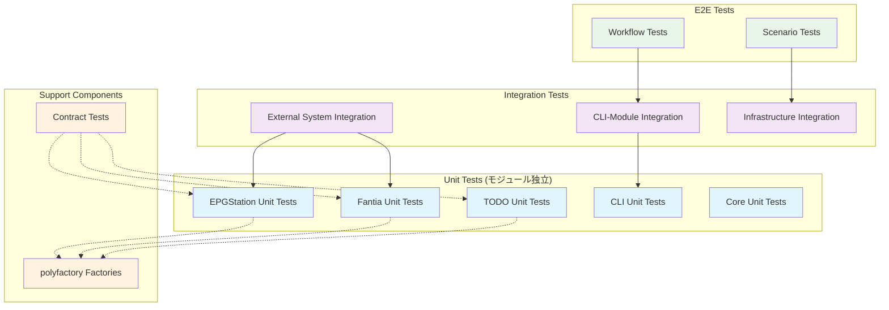
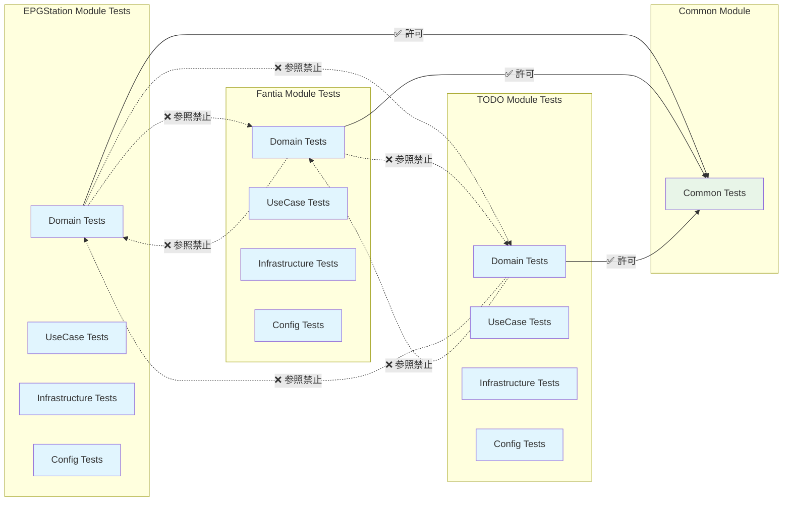

# テスト戦略再構築 - 設計書

**プロジェクト**: moro - モジュラーモノリス準拠テスト設計
**作成日**: 2025-08-13
**設計原則**: モジュール完全独立・構造品質最優先

## 🏗️ アーキテクチャ概要

### モジュラーモノリス準拠設計原則

- **モジュール間相互参照禁止**の徹底
- **各モジュールのテストも完全独立**
- **Type-safe テストデータ生成** (polyfactory)
- **共通部分は`common.py`経由のみ**

### 既存コードベース分析

**現状アーキテクチャ**:

- レイヤードアーキテクチャ + DI (injector)
- モジュール構造: `modules/` 配下に `config.py`, `domain.py`, `infrastructure.py`, `usecases.py`
- テストフレームワーク: pytest + coverage + ruff + mypy
- 設計パターン: 責務分離されたドメイン中心設計

## 🏛️ Modular Monolith Test Architecture

```
tests/
├── unit/                        # 単体テスト層 (70%)
│   ├── modules/                 # モジュール独立テスト
│   │   ├── epgstation/          # EPGStationモジュール独立
│   │   │   ├── test_domain.py
│   │   │   ├── test_usecases.py
│   │   │   ├── test_infrastructure.py
│   │   │   └── test_config.py
│   │   │
│   │   ├── fantia/              # Fantiaモジュール独立
│   │   │   ├── test_domain.py
│   │   │   ├── test_usecases.py
│   │   │   ├── test_infrastructure.py
│   │   │   └── test_config.py
│   │   │
│   │   ├── todo/                # TODOモジュール独立
│   │   │   ├── test_domain.py
│   │   │   ├── test_usecases.py
│   │   │   ├── test_infrastructure.py
│   │   │   └── test_config.py
│   │   │
│   │   └── common/              # 共通モジュールテスト
│   │       └── test_common.py
│   │
│   ├── cli/                     # CLI層テスト（モジュール横断）
│   │   ├── test_epgstation.py
│   │   ├── test_fantia.py
│   │   ├── test_todo.py
│   │   └── test_formatters.py
│   │
│   └── core/                    # コア機能テスト
│       ├── test_config.py
│       ├── test_container.py
│       └── test_settings.py
│
├── integration/                 # 統合テスト層 (20%)
│   ├── cli_to_modules/          # CLI→モジュール統合
│   │   ├── test_epgstation_cli_integration.py
│   │   ├── test_fantia_cli_integration.py
│   │   └── test_todo_cli_integration.py
│   │
│   ├── external_systems/        # 外部システム統合
│   │   ├── test_fantia_api_integration.py
│   │   ├── test_epgstation_api_integration.py
│   │   └── test_file_system_integration.py
│   │
│   └── infrastructure/          # インフラ統合
│       ├── test_database_integration.py
│       └── test_cache_integration.py
│
├── e2e/                        # E2Eテスト層 (10%)
│   ├── workflows/              # 完全ワークフロー
│   │   ├── test_fantia_download_workflow.py
│   │   ├── test_epgstation_recording_workflow.py
│   │   └── test_todo_management_workflow.py
│   │
│   └── scenarios/              # ユーザーシナリオ
│       ├── test_daily_usage_scenarios.py
│       └── test_error_recovery_scenarios.py
│
├── factories/                  # polyfactory テストデータ
│   ├── epgstation_factories.py
│   ├── fantia_factories.py
│   ├── todo_factories.py
│   └── common_factories.py
│
└── contracts/                  # モジュール境界契約
    ├── epgstation_contract.py
    ├── fantia_contract.py
    └── todo_contract.py
```

## 📐 設計図・アーキテクチャ図

### テスト依存関係図



### モジュール独立性保証図



## 🔒 モジュール独立性の実装

### 各モジュールテストの独立性保証

#### EPGStationモジュール独立テスト

```python
# tests/unit/modules/epgstation/test_domain.py
"""EPGStationモジュール独立ドメインテスト

他モジュールへの依存・参照は一切禁止
moro.modules.epgstation.* のみimport許可
"""
import pytest
from moro.modules.epgstation.domain import RecordingData, VideoFile
from moro.modules.common import CommonConfig  # commonのみ許可
# from moro.modules.fantia import ...  # 禁止！
# from moro.modules.todo import ...    # 禁止！

class TestRecordingData:
    def test_format_start_time(self):
        recording = RecordingData(...)
        assert recording.formatted_start_time == "..."
```

#### Fantiaモジュール独立テスト

```python
# tests/unit/modules/fantia/test_usecases.py
"""Fantiaモジュール独立ユースケーステスト

EPGStation/TODO等の他モジュール参照禁止
moro.modules.fantia.* のみimport許可
"""
from moro.modules.fantia.usecases import FantiaSavePostUseCase
from moro.modules.fantia.domain import FantiaPost
from moro.modules.common import CommonConfig  # commonのみ許可

class TestFantiaSavePostUseCase:
    def test_execute_basic_save(self):
        # Fantiaモジュール内部ロジックのみテスト
        pass
```

### 依存関係監視ルール

```python
# tests/unit/modules/ 配下の厳格ルール
✅ from moro.modules.{same_module}.* import ...  # 同一モジュール内OK
✅ from moro.modules.common import ...           # common.pyのみOK
✅ import pytest, unittest.mock, etc...         # テストライブラリOK
❌ from moro.modules.{other_module} import ...   # 他モジュール禁止
❌ from moro.cli.* import ...                   # CLI依存禁止（unit層）
❌ from moro.scenarios.* import ...             # scenarios依存禁止
```

## 🏭 polyfactory による Type-Safe テストデータ生成

### モジュール別Factory設計

#### Fantiaモジュール専用Factory

```python
# tests/factories/fantia_factories.py
"""Fantiaモジュール専用Factory - type hints完全対応"""

from datetime import datetime
from polyfactory import BaseFactory, Fixture
from moro.modules.fantia.domain import FantiaPost, FantiaCreator

class FantiaPostFactory(BaseFactory[FantiaPost]):
    __model__ = FantiaPost

    @classmethod
    def title(cls) -> str:
        return "テスト投稿タイトル"

    @classmethod
    def creator_id(cls) -> int:
        return 12345

    @classmethod
    def created_at(cls) -> datetime:
        return datetime.now()

class FantiaCreatorFactory(BaseFactory[FantiaCreator]):
    __model__ = FantiaCreator

    @classmethod
    def name(cls) -> str:
        return "テストクリエイター"
```

#### EPGStationモジュール専用Factory

```python
# tests/factories/epgstation_factories.py
from polyfactory import BaseFactory
from moro.modules.epgstation.domain import RecordingData, VideoFile

class RecordingDataFactory(BaseFactory[RecordingData]):
    __model__ = RecordingData

    @classmethod
    def name(cls) -> str:
        return "テスト録画番組"

    @classmethod
    def start_at(cls) -> int:
        return 1691683200000

class VideoFileFactory(BaseFactory[VideoFile]):
    __model__ = VideoFile

    @classmethod
    def filename(cls) -> str:
        return "test_video.ts"
```

### Factory使用例

```python
# tests/unit/modules/fantia/test_domain.py
from tests.factories.fantia_factories import FantiaPostFactory

class TestFantiaPost:
    def test_post_creation(self):
        # Type-safe!
        post = FantiaPostFactory.create()
        assert isinstance(post, FantiaPost)
        assert post.title is not None

    def test_post_with_custom_data(self):
        # カスタマイズも型安全
        post = FantiaPostFactory.create(
            title="カスタムタイトル",
            creator_id=99999
        )
        assert post.title == "カスタムタイトル"
```

## 🔄 既存テスト変換戦略

### 巨大ファイルの分解マッピング

#### test_fantia.py (1,189行) → モジュール独立分離

**削除対象**:

```
tests/modules/test_fantia.py  # 1,189行の巨大ファイル（完全削除）
```

**新構造への変換**:

```python
# 1. ドメインロジックテスト抽出
tests/unit/modules/fantia/test_domain.py
- FantiaPost クラステスト
- FantiaCreator クラステスト
- バリデーション関数テスト

# 2. ユースケーステスト抽出
tests/unit/modules/fantia/test_usecases.py
- FantiaSavePostUseCase テスト
- FantiaDownloadUseCase テスト

# 3. インフラテスト抽出
tests/unit/modules/fantia/test_infrastructure.py
- FantiaRepository テスト
- FantiaClient テスト（Mock使用）

# 4. 統合テスト（最小限）
tests/integration/external_systems/test_fantia_api_integration.py
- 実際のAPI呼び出しテスト（少数精鋭）

# 5. E2Eワークフロー（最小限）
tests/e2e/workflows/test_fantia_download_workflow.py
- 完全ダウンロードワークフロー（1-2テストのみ）
```

### 変換ルール

1. **Mock多用統合テスト** → **単体テスト**に分解
2. **複数責務テスト** → **単一責務**に分離
3. **重複テスト** → **最も価値の高いもの1つ**を残して削除
4. **E2E風統合テスト** → **真のE2E**または**削除**
5. **モジュール横断テスト** → **契約テスト**に変換

## 📊 品質メトリクス・監視

### モジュール独立性メトリクス

```python
# 自動チェック可能な独立性メトリクス
独立実行可能性:
  - pytest tests/unit/modules/epgstation/  # 他モジュール無しで実行OK
  - pytest tests/unit/modules/fantia/      # 他モジュール無しで実行OK
  - pytest tests/unit/modules/todo/        # 他モジュール無しで実行OK

依存関係チェック:
  - 禁止import検出ツールによる監視
  - pre-commit hookでの自動チェック
  - CI/CDパイプラインでの依存関係検証
```

### 実行性能要件

- **各モジュール単体テスト**: 2秒以内
- **統合テスト**: 30秒以内
- **E2Eテスト**: 2分以内
- **全体実行**: 5分以内

## 🛠️ 技術スタック

### 開発ツール構成

```toml
[tool.pytest.ini_options]
testpaths = ["tests"]
markers = [
    "unit: Unit tests (module independent, fast)",
    "integration: Integration tests (cross-module, medium)",
    "e2e: End-to-end tests (full workflows, slow)",
    "contract: Contract tests (module boundaries)"
]

# モジュール独立実行サポート
addopts = "--strict-markers --strict-config"

# 並列実行設定
# pytest -m unit -n auto  # 単体テスト並列実行
# pytest -m integration   # 統合テスト逐次実行
```

### 新規依存関係

```bash
# Type-safe testing tools
uv add --dev polyfactory      # Type-safe factory (factory-boy代替)
uv add --dev pytest-xdist     # 並列実行
uv add --dev pytest-benchmark # パフォーマンステスト
uv add --dev hypothesis       # Property-based testing

# 依存関係監視
uv add --dev import-linter    # import ルール監視
```

## 🎯 実装優先順位

### Phase 1: 構造基盤構築

1. 新ディレクトリ構造作成
2. polyfactory セットアップ
3. モジュール独立性チェックツール導入

### Phase 2: 巨大ファイル分解

1. `test_fantia.py` (1,189行) 分解
2. 各モジュールの単体テスト抽出
3. 不要テスト削除

### Phase 3: 統合・E2E最小化

1. 統合テスト精選
2. E2Eテスト最小限実装
3. 契約テスト導入

## 🏁 完成後の状態

### 目標構造

- **15-20ファイル** (現在31ファイルから削減)
- **200-250テスト** (現在380テストから精選)
- **平均150行/ファイル** (現在269行から削減)
- **完全モジュール独立** (相互参照ゼロ)

### 品質保証

- Type-safe テストデータ生成
- モジュール境界の契約保証
- 高速フィードバックループ実現
- 持続可能な保守性確保

---

**設計承認基準**: モジュラーモノリス原則に完全準拠し、構造品質を最優先とした持続可能なテストアーキテクチャの実現
