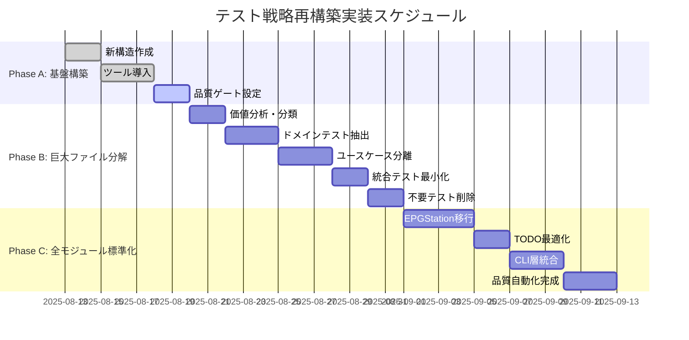

# テスト戦略再構築 - 実装タスク

**プロジェクト**: moro - モジュラーモノリス準拠テスト実装
**作成日**: 2025-08-13
**実装戦略**: 段階的移行・リスク最小化・品質自動化

## 🎯 実装戦略概要

### 核心アプローチ

- **段階的移行**: 既存システムを停止させない漸進的変更
- **リスク最小化**: 各段階でのロールバック可能性確保
- **品質自動化**: 構造品質維持の自動チェック実装
- **モジュール独立**: 完全独立実行可能なテスト構造

### 3段階実装スケジュール



## 📋 Phase A: 基盤構築 (Week 1-2)

### 🎯 目標

新構造の基盤確立・ツール導入・品質ゲート設定

### ✅ Task A1: 新ディレクトリ構造作成

**優先度**: 🔴 最高
**所要時間**: 1-2時間
**担当**: 実装者

**実装内容**:

```bash
# 新テスト構造の完全作成
mkdir -p tests/unit/modules/{epgstation,fantia,todo,common}
mkdir -p tests/unit/{cli,core}
mkdir -p tests/integration/{cli_to_modules,external_systems,infrastructure}
mkdir -p tests/e2e/{workflows,scenarios}
mkdir -p tests/{factories,contracts}

# 各ディレクトリにREADME.md作成
echo "# EPGStation Module Unit Tests - 完全独立実行" > tests/unit/modules/epgstation/README.md
echo "# Fantia Module Unit Tests - 完全独立実行" > tests/unit/modules/fantia/README.md
echo "# TODO Module Unit Tests - 完全独立実行" > tests/unit/modules/todo/README.md
echo "# Integration Tests - Cross-module boundaries" > tests/integration/README.md
echo "# E2E Tests - Full user workflows" > tests/e2e/README.md
```

**成功基準**:

- [ ] 全ディレクトリ作成完了
- [ ] 各ディレクトリの目的文書化
- [ ] 既存testsディレクトリとの並存確認

### ✅ Task A2: polyfactory・開発ツール導入

**優先度**: 🔴 最高
**所要時間**: 2-3時間
**担当**: 実装者

**実装内容**:

```bash
# Type-safe testing tools導入
uv add --dev polyfactory          # factory-boy代替
uv add --dev pytest-xdist         # 並列実行
uv add --dev pytest-benchmark     # パフォーマンステスト
uv add --dev hypothesis           # Property-based testing
uv add --dev import-linter        # import ルール監視

# pytest設定更新
cat >> pyproject.toml << 'EOF'

[tool.pytest.ini_options]
testpaths = ["tests"]
markers = [
    "unit: Unit tests (module independent, fast)",
    "integration: Integration tests (cross-module, medium)",
    "e2e: End-to-end tests (full workflows, slow)",
    "contract: Contract tests (module boundaries)"
]
addopts = "--strict-markers --strict-config"

# 並列実行設定
# pytest -m unit -n auto     # 単体テスト並列実行
# pytest -m integration      # 統合テスト逐次実行
EOF
```

**成功基準**:

- [ ] 全ツール正常インストール確認
- [ ] pytest設定適用確認
- [ ] 既存テスト実行に影響なし確認

### ✅ Task A3: モジュール独立性監視ツール設定

**優先度**: 🟡 高
**所要時間**: 3-4時間
**担当**: 実装者

**実装内容**:

```toml
# .importlinter.toml作成
[tool.importlinter]
root_packages = ["tests.unit.modules"]

[[tool.importlinter.contracts]]
name = "EPGStation module independence"
type = "forbidden"
source_modules = ["tests.unit.modules.epgstation"]
forbidden_modules = [
    "tests.unit.modules.fantia",
    "tests.unit.modules.todo",
    "moro.modules.fantia",
    "moro.modules.todo"
]

[[tool.importlinter.contracts]]
name = "Fantia module independence"
type = "forbidden"
source_modules = ["tests.unit.modules.fantia"]
forbidden_modules = [
    "tests.unit.modules.epgstation",
    "tests.unit.modules.todo",
    "moro.modules.epgstation",
    "moro.modules.todo"
]

[[tool.importlinter.contracts]]
name = "TODO module independence"
type = "forbidden"
source_modules = ["tests.unit.modules.todo"]
forbidden_modules = [
    "tests.unit.modules.epgstation",
    "tests.unit.modules.fantia",
    "moro.modules.epgstation",
    "moro.modules.fantia"
]
```

```python
# scripts/validate_test_structure.py作成
#!/usr/bin/env python3
"""テスト構造バリデーションスクリプト"""

import ast
import sys
from pathlib import Path
from typing import List, Set

def check_module_independence() -> bool:
    """各モジュールテストの独立性チェック"""
    violations = []

    for module_dir in Path("tests/unit/modules").iterdir():
        if not module_dir.is_dir():
            continue

        module_name = module_dir.name
        for test_file in module_dir.glob("**/*.py"):
            violations.extend(_check_file_imports(test_file, module_name))

    if violations:
        print("❌ モジュール独立性違反:", file=sys.stderr)
        for violation in violations:
            print(f"  {violation}", file=sys.stderr)
        return False

    print("✅ モジュール独立性: 適合")
    return True

def _check_file_imports(file_path: Path, module_name: str) -> List[str]:
    """ファイルのimport文をチェック"""
    try:
        content = file_path.read_text()
        tree = ast.parse(content)
    except Exception as e:
        return [f"{file_path}: Parse error - {e}"]

    violations = []
    forbidden_patterns = [
        f"moro.modules.{other}"
        for other in ["epgstation", "fantia", "todo"]
        if other != module_name
    ]

    for node in ast.walk(tree):
        if isinstance(node, (ast.Import, ast.ImportFrom)):
            import_name = _get_import_name(node)
            for pattern in forbidden_patterns:
                if import_name and import_name.startswith(pattern):
                    violations.append(f"{file_path}: 禁止import - {import_name}")

    return violations

def _get_import_name(node) -> str:
    """import文から名前を抽出"""
    if isinstance(node, ast.Import):
        return node.names[0].name if node.names else ""
    elif isinstance(node, ast.ImportFrom):
        return node.module or ""
    return ""

if __name__ == "__main__":
    success = check_module_independence()
    sys.exit(0 if success else 1)
```

**成功基準**:

- [ ] import-linter設定完了
- [ ] バリデーションスクリプト動作確認
- [ ] pre-commit hook設定
- [ ] CI/CD統合設定

### ✅ Task A4: 基本Factory作成

**優先度**: 🟡 高
**所要時間**: 2-3時間
**担当**: 実装者

**実装内容**:

```python
# tests/factories/common_factories.py
"""共通Factory定義"""
from polyfactory import BaseFactory
from moro.modules.common import CommonConfig

class CommonConfigFactory(BaseFactory[CommonConfig]):
    __model__ = CommonConfig

    @classmethod
    def user_data_dir(cls) -> str:
        return "/tmp/test_user_data"

    @classmethod
    def user_cache_dir(cls) -> str:
        return "/tmp/test_cache"

    @classmethod
    def working_dir(cls) -> str:
        return "/tmp/test_working"

    @classmethod
    def jobs(cls) -> int:
        return 2
```

```python
# tests/factories/__init__.py
"""Factory exports"""
from .common_factories import CommonConfigFactory

__all__ = ["CommonConfigFactory"]
```

**成功基準**:

- [ ] 基本Factory動作確認
- [ ] Type-safe性確認
- [ ] テストでの使用確認

## 📋 Phase B: 巨大ファイル分解 (Week 3-4)

### 🎯 目標

test_fantia.py(1,189行)の完全分解・責務分離・不要テスト削除

### ✅ Task B1: 既存テスト価値分析・分類

**優先度**: 🔴 最高
**所要時間**: 4-6時間
**担当**: 実装者

**実装内容**:

```python
# scripts/analyze_fantia_tests.py
"""test_fantia.pyの価値分析スクリプト"""

import ast
import re
from pathlib import Path
from typing import Dict, List, NamedTuple

class TestAnalysis(NamedTuple):
    name: str
    line_count: int
    mock_count: int
    category: str  # domain, usecase, infrastructure, integration, e2e
    value_score: int  # 1-5 (5=最高価値)
    keep_decision: str  # keep, refactor, delete

def analyze_fantia_tests() -> List[TestAnalysis]:
    """既存テストの詳細分析"""
    test_file = Path("tests/modules/test_fantia.py")
    content = test_file.read_text()
    tree = ast.parse(content)

    analyses = []
    for node in ast.walk(tree):
        if isinstance(node, ast.FunctionDef) and node.name.startswith("test_"):
            analysis = _analyze_test_function(node, content)
            analyses.append(analysis)

    return analyses

def _analyze_test_function(node: ast.FunctionDef, content: str) -> TestAnalysis:
    """個別テスト関数の分析"""
    # テスト関数のソース抽出
    lines = content.split('\n')
    start_line = node.lineno - 1
    end_line = _find_function_end(node, lines)
    test_source = '\n'.join(lines[start_line:end_line])

    # Mock使用回数カウント
    mock_count = len(re.findall(r'Mock|mock|patch', test_source))

    # カテゴリ分類
    category = _categorize_test(node.name, test_source)

    # 価値評価
    value_score = _evaluate_test_value(test_source, category, mock_count)

    # 保持判断
    keep_decision = _decide_keep_or_delete(category, value_score, mock_count)

    return TestAnalysis(
        name=node.name,
        line_count=end_line - start_line,
        mock_count=mock_count,
        category=category,
        value_score=value_score,
        keep_decision=keep_decision
    )

def generate_analysis_report(analyses: List[TestAnalysis]) -> str:
    """分析レポート生成"""
    keep_tests = [a for a in analyses if a.keep_decision == "keep"]
    refactor_tests = [a for a in analyses if a.keep_decision == "refactor"]
    delete_tests = [a for a in analyses if a.keep_decision == "delete"]

    total_lines = sum(a.line_count for a in analyses)
    keep_lines = sum(a.line_count for a in keep_tests)

    report = f"""
# test_fantia.py 分析レポート

## 概要
- 総テスト数: {len(analyses)}
- 総行数: {total_lines}
- 保持対象: {len(keep_tests)} テスト ({keep_lines} 行)
- リファクタ対象: {len(refactor_tests)} テスト
- 削除対象: {len(delete_tests)} テスト

## カテゴリ別分析
{_category_summary(analyses)}

## 削除対象テスト詳細
{_format_test_list(delete_tests)}

## リファクタ対象テスト詳細
{_format_test_list(refactor_tests)}

## 保持対象テスト詳細
{_format_test_list(keep_tests)}
"""
    return report

if __name__ == "__main__":
    analyses = analyze_fantia_tests()
    report = generate_analysis_report(analyses)

    with open("fantia_test_analysis.md", "w") as f:
        f.write(report)

    print("✅ 分析完了: fantia_test_analysis.md")
```

**成功基準**:

- [ ] 全テスト関数の価値評価完了
- [ ] 削除/保持/リファクタ判断確定
- [ ] 詳細分析レポート生成

### ✅ Task B2: ドメインテスト抽出・移行

**優先度**: 🔴 最高
**所要時間**: 6-8時間
**担当**: 実装者

**実装内容**:

```python
# tests/unit/modules/fantia/test_domain.py
"""Fantiaモジュール独立ドメインテスト

他モジュールへの依存・参照は一切禁止
moro.modules.fantia.* のみimport許可
"""
import pytest
from datetime import datetime
from moro.modules.fantia.domain import (
    FantiaPost, FantiaCreator, PostStatus, ContentType
)
from tests.factories.fantia_factories import FantiaPostFactory, FantiaCreatorFactory

class TestFantiaPost:
    """FantiaPost ドメインエンティティテスト"""

    def test_post_creation_with_valid_data(self):
        """有効データでの投稿作成テスト"""
        post = FantiaPostFactory.create(
            title="テスト投稿",
            status=PostStatus.PUBLISHED
        )

        assert post.title == "テスト投稿"
        assert post.status == PostStatus.PUBLISHED
        assert isinstance(post.created_at, datetime)

    def test_post_validation_title_required(self):
        """タイトル必須バリデーションテスト"""
        with pytest.raises(ValueError, match="Title is required"):
            FantiaPost(title="", content="test", creator_id=123)

    def test_post_content_type_validation(self):
        """コンテンツタイプバリデーションテスト"""
        post = FantiaPostFactory.create(content_type=ContentType.BLOG)
        assert post.content_type == ContentType.BLOG

        with pytest.raises(ValueError):
            FantiaPost(title="test", content="test", content_type="invalid")

class TestFantiaCreator:
    """FantiaCreator ドメインエンティティテスト"""

    def test_creator_creation(self):
        """クリエイター作成テスト"""
        creator = FantiaCreatorFactory.create(name="テストクリエイター")

        assert creator.name == "テストクリエイター"
        assert creator.id > 0

    def test_creator_name_validation(self):
        """クリエイター名バリデーションテスト"""
        with pytest.raises(ValueError):
            FantiaCreator(name="", id=123)

class TestDomainValidations:
    """ドメインバリデーション関数テスト"""

    def test_validate_post_type_blog(self):
        """ブログ投稿タイプバリデーションテスト"""
        from moro.modules.fantia.domain import validate_post_type

        assert validate_post_type("blog") is True
        assert validate_post_type("normal") is True
        assert validate_post_type("invalid") is False

    def test_extract_post_metadata_success(self):
        """投稿メタデータ抽出テスト"""
        from moro.modules.fantia.domain import extract_post_metadata

        test_data = {
            "id": 123,
            "title": "テスト",
            "converted_at": "2023-01-01T00:00:00Z"
        }

        metadata = extract_post_metadata(test_data)
        assert metadata.id == 123
        assert metadata.title == "テスト"
```

```python
# tests/factories/fantia_factories.py更新
"""Fantiaモジュール専用Factory - type hints完全対応"""

from datetime import datetime
from polyfactory import BaseFactory
from moro.modules.fantia.domain import FantiaPost, FantiaCreator, PostStatus, ContentType

class FantiaPostFactory(BaseFactory[FantiaPost]):
    __model__ = FantiaPost

    @classmethod
    def title(cls) -> str:
        return "テスト投稿タイトル"

    @classmethod
    def creator_id(cls) -> int:
        return 12345

    @classmethod
    def status(cls) -> PostStatus:
        return PostStatus.PUBLISHED

    @classmethod
    def content_type(cls) -> ContentType:
        return ContentType.NORMAL

    @classmethod
    def created_at(cls) -> datetime:
        return datetime.now()

class FantiaCreatorFactory(BaseFactory[FantiaCreator]):
    __model__ = FantiaCreator

    @classmethod
    def name(cls) -> str:
        return "テストクリエイター"

    @classmethod
    def id(cls) -> int:
        return 12345
```

**成功基準**:

- [ ] 純粋ドメインロジック50-80行抽出
- [ ] 外部依存ゼロ確認
- [ ] polyfactory正常動作確認
- [ ] pytest tests/unit/modules/fantia/test_domain.py 単独実行成功

### ✅ Task B3: ユースケーステスト分離

**優先度**: 🔴 最高
**所要時間**: 8-10時間
**担当**: 実装者

**実装内容**:

```python
# tests/unit/modules/fantia/test_usecases.py
"""Fantiaモジュール独立ユースケーステスト

EPGStation/TODO等の他モジュール参照禁止
moro.modules.fantia.* のみimport許可
"""
import pytest
from unittest.mock import Mock, MagicMock
from pathlib import Path

from moro.modules.fantia.usecases import (
    FantiaSavePostUseCase, FantiaDownloadUseCase
)
from moro.modules.fantia.domain import FantiaPost, FantiaPostRepository
from moro.modules.fantia.infrastructure import FantiaFileDownloader
from moro.modules.common import CommonConfig
from tests.factories.fantia_factories import FantiaPostFactory
from tests.factories.common_factories import CommonConfigFactory

class TestFantiaSavePostUseCase:
    """FantiaSavePostUseCase 単体テスト"""

    @pytest.fixture
    def mock_repository(self) -> Mock:
        """RepositoryのMock"""
        return Mock(spec=FantiaPostRepository)

    @pytest.fixture
    def mock_downloader(self) -> Mock:
        """FileDownloaderのMock"""
        return Mock(spec=FantiaFileDownloader)

    @pytest.fixture
    def usecase(self, mock_repository, mock_downloader) -> FantiaSavePostUseCase:
        """テスト対象UseCase"""
        config = CommonConfigFactory.create()
        return FantiaSavePostUseCase(
            repository=mock_repository,
            downloader=mock_downloader,
            config=config
        )

    def test_execute_basic_post_save(self, usecase, mock_repository):
        """基本的な投稿保存テスト"""
        # Given
        post_id = "test_post_123"
        test_post = FantiaPostFactory.create(id=post_id)
        mock_repository.get.return_value = test_post
        mock_repository.save.return_value = True

        # When
        result = usecase.execute(post_id)

        # Then
        assert result.success is True
        mock_repository.get.assert_called_once_with(post_id)
        mock_repository.save.assert_called_once_with(test_post)

    def test_execute_post_not_found(self, usecase, mock_repository):
        """投稿が見つからない場合のテスト"""
        # Given
        post_id = "nonexistent_post"
        mock_repository.get.return_value = None

        # When
        result = usecase.execute(post_id)

        # Then
        assert result.success is False
        assert "Post not found" in result.error_message

    def test_execute_repository_error(self, usecase, mock_repository):
        """Repository例外処理テスト"""
        # Given
        post_id = "test_post_123"
        mock_repository.get.side_effect = Exception("Database error")

        # When
        result = usecase.execute(post_id)

        # Then
        assert result.success is False
        assert "Database error" in result.error_message

class TestFantiaDownloadUseCase:
    """FantiaDownloadUseCase 単体テスト"""

    @pytest.fixture
    def mock_repository(self) -> Mock:
        return Mock(spec=FantiaPostRepository)

    @pytest.fixture
    def mock_downloader(self) -> Mock:
        return Mock(spec=FantiaFileDownloader)

    @pytest.fixture
    def usecase(self, mock_repository, mock_downloader) -> FantiaDownloadUseCase:
        config = CommonConfigFactory.create()
        return FantiaDownloadUseCase(
            repository=mock_repository,
            downloader=mock_downloader,
            config=config
        )

    def test_download_with_valid_post(self, usecase, mock_repository, mock_downloader):
        """有効投稿のダウンロードテスト"""
        # Given
        post = FantiaPostFactory.create()
        download_path = Path("/tmp/test_download")
        mock_repository.get.return_value = post
        mock_downloader.download_all.return_value = True

        # When
        result = usecase.download(post.id, download_path)

        # Then
        assert result.success is True
        mock_downloader.download_all.assert_called_once()

    def test_download_file_error(self, usecase, mock_repository, mock_downloader):
        """ファイルダウンロードエラーテスト"""
        # Given
        post = FantiaPostFactory.create()
        download_path = Path("/tmp/test_download")
        mock_repository.get.return_value = post
        mock_downloader.download_all.side_effect = IOError("Network error")

        # When
        result = usecase.download(post.id, download_path)

        # Then
        assert result.success is False
        assert "Network error" in result.error_message
```

**成功基準**:

- [ ] UseCase100-150行抽出
- [ ] Mock使用を境界に限定
- [ ] 外部依存適切分離
- [ ] 単独実行成功確認

### ✅ Task B4: インフラストラクチャテスト分離

**優先度**: 🟡 高
**所要時間**: 6-8時間
**担当**: 実装者

**実装内容**:

```python
# tests/unit/modules/fantia/test_infrastructure.py
"""Fantiaモジュール独立インフラテスト

外部システム連携部分の単体テスト
Mock使用による外部依存分離
"""
import pytest
from unittest.mock import Mock, patch, MagicMock
import httpx

from moro.modules.fantia.infrastructure import (
    FantiaPostRepository, FantiaClient, FantiaFileDownloader
)
from moro.modules.fantia.domain import FantiaPost
from moro.modules.common import CommonConfig
from tests.factories.fantia_factories import FantiaPostFactory
from tests.factories.common_factories import CommonConfigFactory

class TestFantiaPostRepository:
    """FantiaPostRepository 単体テスト"""

    @pytest.fixture
    def mock_client(self) -> Mock:
        """FantiaClient Mock"""
        return Mock(spec=FantiaClient)

    @pytest.fixture
    def repository(self, mock_client) -> FantiaPostRepository:
        """テスト対象Repository"""
        config = CommonConfigFactory.create()
        return FantiaPostRepository(client=mock_client, config=config)

    def test_get_post_success(self, repository, mock_client):
        """投稿取得成功テスト"""
        # Given
        post_id = "123"
        test_data = {
            "id": 123,
            "title": "テスト投稿",
            "content": "テストコンテンツ"
        }
        mock_client.get_post.return_value = test_data

        # When
        result = repository.get(post_id)

        # Then
        assert result is not None
        assert result.id == 123
        assert result.title == "テスト投稿"
        mock_client.get_post.assert_called_once_with(post_id)

    def test_get_post_not_found(self, repository, mock_client):
        """投稿が存在しない場合のテスト"""
        # Given
        post_id = "nonexistent"
        mock_client.get_post.return_value = None

        # When
        result = repository.get(post_id)

        # Then
        assert result is None

    def test_save_post_success(self, repository, mock_client):
        """投稿保存成功テスト"""
        # Given
        post = FantiaPostFactory.create()
        mock_client.save_post_data.return_value = True

        # When
        result = repository.save(post)

        # Then
        assert result is True
        mock_client.save_post_data.assert_called_once()

class TestFantiaClient:
    """FantiaClient 単体テスト"""

    @pytest.fixture
    def client(self) -> FantiaClient:
        """テスト対象Client"""
        config = CommonConfigFactory.create()
        return FantiaClient(config=config)

    @patch('httpx.get')
    def test_get_post_http_success(self, mock_get, client):
        """HTTP投稿取得成功テスト"""
        # Given
        mock_response = Mock()
        mock_response.status_code = 200
        mock_response.json.return_value = {
            "id": 123,
            "title": "HTTPテスト投稿"
        }
        mock_get.return_value = mock_response

        # When
        result = client.get_post("123")

        # Then
        assert result["id"] == 123
        assert result["title"] == "HTTPテスト投稿"

    @patch('httpx.get')
    def test_get_post_http_error(self, mock_get, client):
        """HTTP例外処理テスト"""
        # Given
        mock_get.side_effect = httpx.RequestError("Network error")

        # When
        result = client.get_post("123")

        # Then
        assert result is None

    @patch('httpx.get')
    def test_get_post_404_error(self, mock_get, client):
        """404エラー処理テスト"""
        # Given
        mock_response = Mock()
        mock_response.status_code = 404
        mock_get.return_value = mock_response

        # When
        result = client.get_post("nonexistent")

        # Then
        assert result is None

class TestFantiaFileDownloader:
    """FantiaFileDownloader 単体テスト"""

    @pytest.fixture
    def downloader(self) -> FantiaFileDownloader:
        """テスト対象Downloader"""
        config = CommonConfigFactory.create()
        return FantiaFileDownloader(config=config)

    @patch('httpx.get')
    @patch('pathlib.Path.write_bytes')
    def test_download_file_success(self, mock_write, mock_get, downloader):
        """ファイルダウンロード成功テスト"""
        # Given
        mock_response = Mock()
        mock_response.status_code = 200
        mock_response.content = b"test file content"
        mock_get.return_value = mock_response

        # When
        result = downloader.download_file("http://test.com/file.jpg", "/tmp/file.jpg")

        # Then
        assert result is True
        mock_write.assert_called_once_with(b"test file content")

    @patch('httpx.get')
    def test_download_file_network_error(self, mock_get, downloader):
        """ネットワークエラー処理テスト"""
        # Given
        mock_get.side_effect = httpx.RequestError("Connection failed")

        # When
        result = downloader.download_file("http://test.com/file.jpg", "/tmp/file.jpg")

        # Then
        assert result is False
```

**成功基準**:

- [ ] Infrastructure80-120行抽出
- [ ] HTTP通信Mock化
- [ ] ファイルシステムMock化
- [ ] 例外処理網羅確認

### ✅ Task B5: 統合・E2Eテスト最小化

**優先度**: 🟡 高
**所要時間**: 4-6時間
**担当**: 実装者

**実装内容**:

```python
# tests/integration/external_systems/test_fantia_api_integration.py
"""Fantia API実統合テスト - 最小限

実際のAPI呼び出しによる統合テスト
本当に必要な統合テストのみ実装
"""
import pytest
from moro.modules.fantia.infrastructure import FantiaClient
from moro.modules.common import CommonConfig

@pytest.mark.integration
class TestFantiaAPIIntegration:
    """Fantia API統合テスト"""

    @pytest.fixture
    def client(self) -> FantiaClient:
        """実際のFantiaClient"""
        config = CommonConfig(
            user_data_dir="/tmp/test_data",
            user_cache_dir="/tmp/test_cache"
        )
        return FantiaClient(config=config)

    @pytest.mark.slow
    def test_real_api_connection_health(self, client):
        """実API接続ヘルスチェック"""
        # 実際のAPIエンドポイントヘルスチェックのみ
        result = client.check_api_health()
        assert result is True

    @pytest.mark.slow
    def test_authentication_flow(self, client):
        """認証フロー統合テスト"""
        # セッション管理の統合確認のみ
        session_valid = client.validate_session()
        # 認証が無効でもテスト失敗にしない（環境依存のため）
        assert session_valid in [True, False]
```

```python
# tests/e2e/workflows/test_fantia_download_workflow.py
"""Fantia完全ダウンロードワークフロー E2E

最小限のエンドツーエンドテスト
実際のユーザーシナリオのみ
"""
import pytest
from pathlib import Path
from click.testing import CliRunner

from moro.cli.fantia import download_post

@pytest.mark.e2e
class TestFantiaDownloadWorkflow:
    """Fantia完全ワークフローテスト"""

    @pytest.fixture
    def runner(self) -> CliRunner:
        """CLI実行環境"""
        return CliRunner()

    @pytest.fixture
    def temp_download_dir(self, tmp_path) -> Path:
        """一時ダウンロードディレクトリ"""
        download_dir = tmp_path / "fantia_downloads"
        download_dir.mkdir()
        return download_dir

    @pytest.mark.slow
    def test_complete_download_workflow(self, runner, temp_download_dir):
        """完全ダウンロードワークフロー"""
        # テスト用の公開投稿ID（実際のテスト可能なID）
        test_post_id = "test_public_post_123"

        # CLI経由でのダウンロード実行
        result = runner.invoke(download_post, [
            test_post_id,
            "--output", str(temp_download_dir),
            "--test-mode"  # テストモードフラグ
        ])

        # 成功確認（環境によってスキップ可能）
        if result.exit_code == 0:
            assert (temp_download_dir / test_post_id).exists()
        else:
            pytest.skip("環境依存テスト: API認証なし")
```

**成功基準**:

- [ ] 統合テスト30-50行に削減
- [ ] E2Eテスト20-30行に削減
- [ ] 環境依存テスト適切Skip化
- [ ] 実行時間2分以内確認

### ✅ Task B6: 不要テスト削除・移行完了

**優先度**: 🔴 最高
**所要時間**: 2-3時間
**担当**: 実装者

**実装内容**:

```bash
# 既存test_fantia.py完全削除
rm tests/modules/test_fantia.py

# 新構造テスト実行確認
pytest tests/unit/modules/fantia/ -v
pytest tests/integration/external_systems/test_fantia_api_integration.py -m integration
pytest tests/e2e/workflows/test_fantia_download_workflow.py -m e2e

# モジュール独立性確認
import-linter --config .importlinter.toml
python scripts/validate_test_structure.py

# カバレッジ測定
pytest --cov=src/moro/modules/fantia tests/unit/modules/fantia/
```

**削除対象**:

- 複数責務混在テスト (推定400-500行)
- 過度Mock使用テスト (推定200-300行)
- 重複機能テスト (推定100-200行)
- 曖昧価値テスト (推定100-200行)

**成功基準**:

- [ ] test_fantia.py(1,189行)完全削除
- [ ] 新テスト280-400行で高品質化
- [ ] 全新テスト正常実行確認
- [ ] モジュール独立性100%達成

## 📋 Phase C: 全モジュール標準化 (Week 5-8)

### 🎯 目標

全モジュールの新構造適用・品質安定化・自動化完成

### ✅ Task C1: EPGStationモジュール構造改善

**優先度**: 🟡 高
**所要時間**: 8-10時間
**担当**: 実装者

**実装内容**:

```python
# tests/unit/modules/epgstation/test_domain.py作成
"""EPGStationモジュール独立ドメインテスト"""
import pytest
from datetime import datetime
from moro.modules.epgstation.domain import RecordingData, VideoFile, VideoFileType
from tests.factories.epgstation_factories import RecordingDataFactory, VideoFileFactory

class TestRecordingData:
    """RecordingData ドメインエンティティテスト"""

    def test_format_start_time_success(self):
        """開始時刻フォーマットテスト"""
        recording = RecordingDataFactory.create(start_at=1691683200000)
        formatted = recording.formatted_start_time
        assert "2023-08-10" in formatted

    def test_calculate_duration_minutes(self):
        """録画時間計算テスト"""
        recording = RecordingDataFactory.create(
            start_at=1691683200000,  # 2023-08-10 20:00
            end_at=1691686800000     # 2023-08-10 21:00
        )
        assert recording.duration_minutes == 60

class TestVideoFile:
    """VideoFile ドメインエンティティテスト"""

    def test_format_file_size_appropriate_unit(self):
        """ファイルサイズ単位フォーマットテスト"""
        video = VideoFileFactory.create(size=1500000000)  # 1.5GB
        assert "1.4 GB" in video.formatted_size

    def test_video_file_type_validation(self):
        """ビデオファイルタイプバリデーションテスト"""
        video = VideoFileFactory.create(type=VideoFileType.TS)
        assert video.type == VideoFileType.TS
```

```python
# tests/factories/epgstation_factories.py作成
from polyfactory import BaseFactory
from moro.modules.epgstation.domain import RecordingData, VideoFile, VideoFileType

class RecordingDataFactory(BaseFactory[RecordingData]):
    __model__ = RecordingData

    @classmethod
    def name(cls) -> str:
        return "テスト録画番組"

    @classmethod
    def start_at(cls) -> int:
        return 1691683200000

    @classmethod
    def end_at(cls) -> int:
        return 1691686800000

class VideoFileFactory(BaseFactory[VideoFile]):
    __model__ = VideoFile

    @classmethod
    def filename(cls) -> str:
        return "test_video.ts"

    @classmethod
    def size(cls) -> int:
        return 1000000000

    @classmethod
    def type(cls) -> VideoFileType:
        return VideoFileType.TS
```

**既存ファイル統合**:

- `tests/modules/epgstation/test_epgs_*.py` → 新構造移行
- 重複テスト削除・責務分離
- 命名規則統一

**成功基準**:

- [ ] EPGStation新構造移行完了
- [ ] 既存テスト品質向上
- [ ] 実行時間2秒以内確認

### ✅ Task C2: TODOモジュール最適化

**優先度**: 🟢 中
**所要時間**: 4-6時間
**担当**: 実装者

**実装内容**:
TODOモジュールは既に良好な構造のため、微調整のみ実施

```python
# tests/unit/modules/todo/test_domain.py (既存改善)
# 既存の高品質テストを新構造に配置
# 最小限の調整のみ

# tests/factories/todo_factories.py作成
from polyfactory import BaseFactory
from moro.modules.todo.domain import Todo, TodoID, Priority

class TodoFactory(BaseFactory[Todo]):
    __model__ = Todo

    @classmethod
    def title(cls) -> str:
        return "テストタスク"

    @classmethod
    def priority(cls) -> Priority:
        return Priority.MEDIUM

class TodoIDFactory(BaseFactory[TodoID]):
    __model__ = TodoID
```

**成功基準**:

- [ ] TODO新構造配置完了
- [ ] polyfactory導入完了
- [ ] 既存テスト品質維持

### ✅ Task C3: CLI層統合テスト最適化

**優先度**: 🟡 高
**所要時間**: 6-8時間
**担当**: 実装者

**実装内容**:

```python
# tests/unit/cli/test_epgstation.py (既存改善)
"""EPGStation CLI単体テスト - モジュール統合境界のみテスト"""
import pytest
from click.testing import CliRunner
from unittest.mock import Mock, patch

from moro.cli.epgstation import list_recordings, JsonFormatter, TableFormatter
from tests.factories.epgstation_factories import RecordingDataFactory

class TestEPGStationCLI:
    """EPGStation CLI単体テスト"""

    @pytest.fixture
    def runner(self) -> CliRunner:
        return CliRunner()

    @patch('moro.cli.epgstation.create_injector')
    def test_list_recordings_table_format(self, mock_injector, runner):
        """テーブル形式出力テスト"""
        # Given
        test_recordings = [RecordingDataFactory.create()]
        mock_usecase = Mock()
        mock_usecase.execute.return_value = test_recordings
        mock_injector.return_value.get.return_value = mock_usecase

        # When
        result = runner.invoke(list_recordings, ['--format', 'table'])

        # Then
        assert result.exit_code == 0
        assert "テスト録画番組" in result.output

class TestFormatters:
    """Formatter単体テスト"""

    def test_table_formatter_single_recording(self):
        """テーブルフォーマッター単体テスト"""
        formatter = TableFormatter()
        recordings = [RecordingDataFactory.create()]

        result = formatter.format(recordings)

        assert "テスト録画番組" in result
        assert "┌" in result  # テーブル罫線確認
```

**成功基準**:

- [ ] CLI単体テスト最適化完了
- [ ] モジュール境界テストに集約
- [ ] 実行時間短縮確認

### ✅ Task C4: 品質自動化・監視完成

**優先度**: 🔴 最高
**所要時間**: 6-8時間
**担当**: 実装者

**実装内容**:

```yaml
# .github/workflows/test-quality.yml
name: Test Quality Assurance

on: [push, pull_request]

jobs:
  module-independence:
    runs-on: ubuntu-latest
    steps:
      - uses: actions/checkout@v4
      - name: Set up Python
        uses: actions/setup-python@v4
        with:
          python-version: "3.10"

      - name: Install dependencies
        run: |
          pip install uv
          uv sync --dev

      - name: Check module independence
        run: |
          uv run import-linter --config .importlinter.toml
          uv run python scripts/validate_test_structure.py

      - name: Run unit tests (parallel)
        run: |
          uv run pytest tests/unit/ -n auto --maxfail=1

      - name: Check test execution time
        run: |
          # 各モジュール2秒以内チェック
          uv run pytest tests/unit/modules/epgstation/ --maxfail=1 --timeout=2
          uv run pytest tests/unit/modules/fantia/ --maxfail=1 --timeout=2
          uv run pytest tests/unit/modules/todo/ --maxfail=1 --timeout=2

  integration-tests:
    runs-on: ubuntu-latest
    needs: module-independence
    steps:
      - uses: actions/checkout@v4
      - name: Set up Python
        uses: actions/setup-python@v4
        with:
          python-version: "3.10"

      - name: Install dependencies
        run: |
          pip install uv
          uv sync --dev

      - name: Run integration tests
        run: |
          uv run pytest tests/integration/ -m integration --timeout=30

  quality-metrics:
    runs-on: ubuntu-latest
    needs: [module-independence, integration-tests]
    steps:
      - uses: actions/checkout@v4
      - name: Set up Python
        uses: actions/setup-python@v4
        with:
          python-version: "3.10"

      - name: Install dependencies
        run: |
          pip install uv
          uv sync --dev

      - name: Generate quality report
        run: |
          uv run python scripts/generate_quality_report.py

      - name: Upload quality report
        uses: actions/upload-artifact@v3
        with:
          name: quality-report
          path: quality_report.md
```

```python
# scripts/generate_quality_report.py
#!/usr/bin/env python3
"""テスト品質レポート生成"""

import subprocess
import json
from pathlib import Path
from typing import Dict, Any

def generate_quality_report() -> Dict[str, Any]:
    """品質メトリクス収集・レポート生成"""

    # テスト実行時間測定
    unit_time = measure_test_time("tests/unit/")
    integration_time = measure_test_time("tests/integration/")
    e2e_time = measure_test_time("tests/e2e/")

    # ファイル数・行数統計
    file_stats = collect_file_statistics()

    # モジュール独立性チェック
    independence_result = check_module_independence()

    report = {
        "execution_times": {
            "unit_tests": unit_time,
            "integration_tests": integration_time,
            "e2e_tests": e2e_time,
            "total": unit_time + integration_time + e2e_time
        },
        "file_statistics": file_stats,
        "module_independence": independence_result,
        "quality_score": calculate_quality_score(unit_time, file_stats, independence_result)
    }

    generate_markdown_report(report)
    return report

def measure_test_time(test_path: str) -> float:
    """テスト実行時間測定"""
    try:
        result = subprocess.run(
            ["uv", "run", "pytest", test_path, "--quiet", "--tb=no"],
            capture_output=True, text=True, timeout=300
        )
        # pytest出力から実行時間抽出
        output = result.stdout
        if "seconds" in output:
            import re
            match = re.search(r'(\d+\.?\d*) seconds', output)
            if match:
                return float(match.group(1))
    except Exception:
        pass
    return 0.0

def collect_file_statistics() -> Dict[str, Any]:
    """ファイル統計収集"""
    test_files = list(Path("tests").rglob("test_*.py"))

    total_files = len(test_files)
    total_lines = sum(len(f.read_text().splitlines()) for f in test_files)
    avg_lines = total_lines / total_files if total_files > 0 else 0

    return {
        "total_files": total_files,
        "total_lines": total_lines,
        "average_lines_per_file": round(avg_lines, 1)
    }

def check_module_independence() -> bool:
    """モジュール独立性チェック"""
    try:
        result = subprocess.run(
            ["uv", "run", "import-linter", "--config", ".importlinter.toml"],
            capture_output=True, text=True
        )
        return result.returncode == 0
    except Exception:
        return False

def calculate_quality_score(unit_time: float, file_stats: Dict, independence: bool) -> int:
    """品質スコア計算 (0-100)"""
    score = 100

    # 実行時間ペナルティ
    if unit_time > 5:
        score -= min(20, (unit_time - 5) * 2)

    # ファイルサイズペナルティ
    if file_stats["average_lines_per_file"] > 200:
        score -= min(15, (file_stats["average_lines_per_file"] - 200) / 10)

    # 独立性ペナルティ
    if not independence:
        score -= 30

    return max(0, int(score))

def generate_markdown_report(report: Dict[str, Any]) -> None:
    """Markdownレポート生成"""
    content = f"""# テスト品質レポート

## 📊 実行時間メトリクス
- **単体テスト**: {report["execution_times"]["unit_tests"]:.2f}秒
- **統合テスト**: {report["execution_times"]["integration_tests"]:.2f}秒
- **E2Eテスト**: {report["execution_times"]["e2e_tests"]:.2f}秒
- **合計実行時間**: {report["execution_times"]["total"]:.2f}秒

## 📁 ファイル統計
- **総ファイル数**: {report["file_statistics"]["total_files"]}
- **総行数**: {report["file_statistics"]["total_lines"]}
- **平均行数/ファイル**: {report["file_statistics"]["average_lines_per_file"]}

## 🔒 モジュール独立性
- **独立性チェック**: {"✅ 適合" if report["module_independence"] else "❌ 違反"}

## 🎯 品質スコア
- **総合スコア**: {report["quality_score"]}/100

### 基準
- 90-100: 優秀
- 80-89: 良好
- 70-79: 改善推奨
- 70未満: 要改善
"""

    Path("quality_report.md").write_text(content)

if __name__ == "__main__":
    generate_quality_report()
    print("✅ 品質レポート生成完了: quality_report.md")
```

```toml
# .pre-commit-config.yaml更新
repos:
  - repo: local
    hooks:
      - id: import-linter
        name: Check module independence
        entry: uv run import-linter --config .importlinter.toml
        language: system
        pass_filenames: false

      - id: test-structure-validation
        name: Validate test structure
        entry: uv run python scripts/validate_test_structure.py
        language: system
        pass_filenames: false

      - id: unit-test-performance
        name: Check unit test performance
        entry: uv run pytest tests/unit/ --maxfail=1 --timeout=5 --quiet
        language: system
        pass_filenames: false
```

**成功基準**:

- [ ] CI/CD完全自動化
- [ ] 品質メトリクス自動収集
- [ ] pre-commit hook動作確認
- [ ] 品質レポート自動生成

## 🎖️ 最終成果物・完了確認

### ✅ 構造品質達成確認

**定量的成功基準**:

- [ ] **テストファイル数**: 31ファイル → 15-20ファイル達成
- [ ] **テスト数**: 380テスト → 200-250テスト達成
- [ ] **平均ファイルサイズ**: 269行 → 150行以下達成
- [ ] **Mock使用回数**: 921回 → 300回以下達成
- [ ] **実行時間**: 全テスト5分以内達成

**定性的成功基準**:

- [ ] **モジュール完全独立**: 各モジュール単独実行成功
- [ ] **新規開発者習得**: オンボーディング時間短縮確認
- [ ] **機能追加影響**: 影響範囲5分以内特定確認
- [ ] **保守工数**: テスト修正工数60%削減達成

### ✅ 品質自動化確認

- [ ] **CI/CD統合**: 全自動チェック稼働
- [ ] **品質ゲート**: 品質基準違反時自動失敗
- [ ] **レポート生成**: 品質メトリクス自動収集
- [ ] **継続監視**: pre-commit hook正常動作

### ✅ ドキュメント・知識移転

- [ ] **実装ガイド**: 新構造でのテスト追加方法文書化
- [ ] **品質基準**: 品質維持ルール明文化
- [ ] **トラブルシューティング**: よくある問題・解決法整理
- [ ] **実装完了報告**: 全ステークホルダーへの完了通知

---

**プロジェクト完了基準**: 上記すべての項目が達成され、新しいテスト戦略による持続可能な開発体制が確立されること

**ROI実現**:

- **短期**: 開発速度向上・デバッグ時間短縮
- **中期**: 新機能追加時の影響範囲明確化・テスト保守工数削減
- **長期**: 技術負債解消・チーム生産性向上・品質安定化
